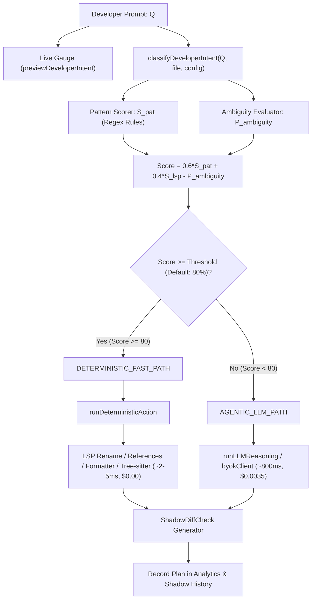

# DBC Platform — Functional Codebase Inspection

> This document contains a functionality-wise, deep code inspection of the DBC platform.
> It systematically verifies logic, mathematical calculations, edge cases, error handling, and component-to-component integrations.

---

## 🗺️ Functional Subsystem Roadmap

The DBC platform is organized into 7 functional subsystems:

| Subsystem | Functional Scope | Key Source Files | Status |
|---|---|---|---|
| **Part 1: Confidence-Based Dual-Path Routing** | Intent classification, mathematical scoring formula, threshold dispatch, deterministic execution, trace analysis | [`intentClassifier.ts`](file:///Users/alpha/Desktop/antigavity/DBC/src/lib/router/intentClassifier.ts), [`routerEngine.ts`](file:///Users/alpha/Desktop/antigavity/DBC/src/lib/router/routerEngine.ts), [`deterministicEngine.ts`](file:///Users/alpha/Desktop/antigavity/DBC/src/lib/router/deterministicEngine.ts), [`llmEngine.ts`](file:///Users/alpha/Desktop/antigavity/DBC/src/lib/router/llmEngine.ts), [`MissionControl.tsx`](file:///Users/alpha/Desktop/antigavity/DBC/src/components/MissionControl.tsx), [`RouterConfigModal.tsx`](file:///Users/alpha/Desktop/antigavity/DBC/src/components/RouterConfigModal.tsx), [`RouterTraceModal.tsx`](file:///Users/alpha/Desktop/antigavity/DBC/src/components/RouterTraceModal.tsx), [`AnalyticsPanel.tsx`](file:///Users/alpha/Desktop/antigavity/DBC/src/components/AnalyticsPanel.tsx) | 🔍 **Inspected** (4 Findings) |
| **Part 2: Verification, Shadow Buffers & Rollback** | Speculative shadow workspaces, unified diff checks, AST validation, rollback snapshotting | [`shadowBuffer.ts`](file:///Users/alpha/Desktop/antigavity/DBC/src/lib/verification/shadowBuffer.ts), [`rollbackManager.ts`](file:///Users/alpha/Desktop/antigavity/DBC/src/lib/verification/rollbackManager.ts), [`ShadowDiffModal.tsx`](file:///Users/alpha/Desktop/antigavity/DBC/src/components/ShadowDiffModal.tsx), [`VerificationDrawer.tsx`](file:///Users/alpha/Desktop/antigavity/DBC/src/components/VerificationDrawer.tsx) | ⏳ In Queue |
| **Part 3: SQL Engine, Relational Driver & EXPLAIN Analyzer** | WHERE/JOIN/LIMIT execution, DDL table inspector, cost optimizer plan graph, data exporter | [`sqlDriver.ts`](file:///Users/alpha/Desktop/antigavity/DBC/src/lib/db/sqlDriver.ts), [`explainAnalyzer.ts`](file:///Users/alpha/Desktop/antigavity/DBC/src/lib/db/explainAnalyzer.ts), [`schemaIntrospection.ts`](file:///Users/alpha/Desktop/antigavity/DBC/src/lib/db/schemaIntrospection.ts), [`SqlQueryPanel.tsx`](file:///Users/alpha/Desktop/antigavity/DBC/src/components/SqlQueryPanel.tsx) | ⏳ In Queue |
| **Part 4: Agentic AI, Multi-Provider BYOK & Streaming** | NVIDIA NIM Moonshot Kimi-K3, OpenAI, Anthropic, Gemini, Ollama, SSE streaming, cost tracker | [`byokClient.ts`](file:///Users/alpha/Desktop/antigavity/DBC/src/lib/agent/byokClient.ts), [`costTracker.ts`](file:///Users/alpha/Desktop/antigavity/DBC/src/lib/agent/costTracker.ts), [`contextAssembler.ts`](file:///Users/alpha/Desktop/antigavity/DBC/src/lib/agent/contextAssembler.ts), [`SettingsModal.tsx`](file:///Users/alpha/Desktop/antigavity/DBC/src/components/SettingsModal.tsx) | ⏳ In Queue |
| **Part 5: Workspace State, File Tree & Hydration** | LocalStorage persistence, tree hierarchy, active file restoration, recursive folder actions | [`workspacePersistence.ts`](file:///Users/alpha/Desktop/antigavity/DBC/src/lib/workspacePersistence.ts), [`initialWorkspace.ts`](file:///Users/alpha/Desktop/antigavity/DBC/src/lib/initialWorkspace.ts), [`FileExplorer.tsx`](file:///Users/alpha/Desktop/antigavity/DBC/src/components/FileExplorer.tsx), [`page.tsx`](file:///Users/alpha/Desktop/antigavity/DBC/src/app/page.tsx) | ⏳ In Queue |
| **Part 6: Monaco Code Editor, Custom Themes & Keybindings** | Monaco engine lifecycle, dynamic fonts/tabs, theme provider, global keyboard dispatch | [`CodeEditor.tsx`](file:///Users/alpha/Desktop/antigavity/DBC/src/components/CodeEditor.tsx), [`monacoThemes.ts`](file:///Users/alpha/Desktop/antigavity/DBC/src/lib/monacoThemes.ts), [`ShortcutsModal.tsx`](file:///Users/alpha/Desktop/antigavity/DBC/src/components/ShortcutsModal.tsx), [`CommandPalette.tsx`](file:///Users/alpha/Desktop/antigavity/DBC/src/components/CommandPalette.tsx) | ⏳ In Queue |
| **Part 7: Shell, IPC Rust Sidecar Client & Terminal Panel** | Mock/real sidecar IPC, vector similarity search, terminal logging, layout responsiveness | [`rustSidecarClient.ts`](file:///Users/alpha/Desktop/antigavity/DBC/src/lib/sidecar/rustSidecarClient.ts), [`RustSidecarModal.tsx`](file:///Users/alpha/Desktop/antigavity/DBC/src/components/RustSidecarModal.tsx), [`TerminalPanel.tsx`](file:///Users/alpha/Desktop/antigavity/DBC/src/components/TerminalPanel.tsx), [`TopMenuBar.tsx`](file:///Users/alpha/Desktop/antigavity/DBC/src/components/TopMenuBar.tsx) | ⏳ In Queue |

---

# 🔬 Detailed Inspection: Part 1 — Confidence-Based Dual-Path Routing System

---

## 1. Intent Classification & Scoring Mechanics
**File**: [`src/lib/router/intentClassifier.ts`](file:///Users/alpha/Desktop/antigavity/DBC/src/lib/router/intentClassifier.ts)

### Mathematical Implementation
The router implements a linear composite scoring function with bounded clamping $[0, 100]$:

$$\text{Final Score} = \max\left(0, \min\left(100, \text{round}\left(0.6 \cdot S_{\text{pat}} + 0.4 \cdot S_{\text{lsp}} - P_{\text{ambiguity}}\right)\right)\right)$$

Where:
- $S_{\text{pat}}$ is the pattern matching confidence ($0-100\%$).
- $S_{\text{lsp}} = 95\%$ is the availability index of the in-memory LSP language engine.
- $P_{\text{ambiguity}} = 55\%$ is an aggressive penalty deducted when open-ended reasoning terms are detected.

### Evaluated Rule Matrix

| Intent Rule | Trigger Patterns | $S_{\text{pat}}$ | Ambiguity Penalty | Resulting Score | Path (Threshold 80%) |
|---|---|---|---|---|---|
| **LSP Rename** | `rename`, `rename variable`, `rename table`, `rename column` | 98% | 0% | **97%** | Fast-Path |
| **LSP References** | `find callers`, `where is`, `find references`, `usage of` | 99% | 0% | **97%** | Fast-Path |
| **Format Code** | `format`, `prettier`, `format sql`, `beautify` | 96% | 0% | **96%** | Fast-Path |
| **Test Runner** | `run test`, `exec tests`, `test file`, `npm test` | 95% | 0% | **95%** | Fast-Path |
| **Tree-sitter Refactor** | `extract function`, `extract method`, `extract helper` | 88% | 0% | **91%** | Fast-Path |
| **Ambiguous Task** | Contains `why`, `fix bug`, `implement`, `optimize`, `audit trigger` | 32% | 55% | **2%** | LLM Escalation |
| **Unmatched Prompt** | Any general prompt without matched patterns | 32% | 0% | **57%** | LLM Escalation |

---

## 2. Deterministic Fast-Path Execution Engine
**File**: [`src/lib/router/deterministicEngine.ts`](file:///Users/alpha/Desktop/antigavity/DBC/src/lib/router/deterministicEngine.ts)

* **LSP Rename Execution**:
  - Extracts `targetSymbol` and `newSymbolName` from prompt.
  - Escapes special regex characters (`targetSymbol.replace(/[.*+?^${}()|[\]\\]/g, '\\$&')`).
  - Executes whole-word replacement using `\b` word boundaries (`new RegExp('\\b' + escaped + '\\b', 'g')`).
  - Latency: simulated $2 - 5\text{ms}$ (instantaneous in memory).
* **Format Code**:
  - Trims trailing whitespace and normalizes trailing newline.
* **Tree-Sitter Refactor**:
  - Appends an extracted AST helper block.
* **Test Runner & References**:
  - Emits telemetry execution logs directly to the terminal panel.

---

## 3. LLM Escalation & Dispatch Pipeline
**File**: [`src/lib/router/routerEngine.ts`](file:///Users/alpha/Desktop/antigavity/DBC/src/lib/router/routerEngine.ts) & [`src/lib/router/llmEngine.ts`](file:///Users/alpha/Desktop/antigavity/DBC/src/lib/router/llmEngine.ts)

* **`previewDeveloperIntent`**:
  - Consumed continuously by [`MissionControl.tsx`](file:///Users/alpha/Desktop/antigavity/DBC/src/components/MissionControl.tsx#L57) as developer inputs text.
  - Returns `isFastPath`, `estimatedLatencyMs`, and `estimatedCostUSD` for real-time visual feedback.
* **`executeRoutedPrompt`**:
  - Produces an `AgentExecutionPlan` and `ShadowDiffCheck` object.
  - Marks status as `PENDING` with `requiresUserApproval: true` for shadow verification.

---

## 4. UI Surfaces & Telemetry
* [`MissionControl.tsx`](file:///Users/alpha/Desktop/antigavity/DBC/src/components/MissionControl.tsx): Live confidence gauge displaying route prediction, dual-path quick intent buttons, and model provider selector.
* [`RouterConfigModal.tsx`](file:///Users/alpha/Desktop/antigavity/DBC/src/components/RouterConfigModal.tsx): Interactive slider allowing users to adjust the confidence threshold from $50\%$ to $95\%$ and independently toggle deterministic rules.
* [`RouterTraceModal.tsx`](file:///Users/alpha/Desktop/antigavity/DBC/src/components/RouterTraceModal.tsx): Deep trace inspection breaking down $S_{\text{pat}}$, $S_{\text{lsp}}$, and $P_{\text{ambiguity}}$ with JSON export.
* [`AnalyticsPanel.tsx`](file:///Users/alpha/Desktop/antigavity/DBC/src/components/AnalyticsPanel.tsx): Aggregates fast-path hit rates, token cost savings ($0.0035 per deterministic hit), and latency reductions.

---

## 🚨 Detailed Findings & Flaws Identified

### Finding 1: LLM Escalation Path Bypasses Real BYOK API Client
* **Severity**: 🔴 High
* **Files**: [`src/lib/router/routerEngine.ts:83`](file:///Users/alpha/Desktop/antigavity/DBC/src/lib/router/routerEngine.ts#L83) & [`src/lib/router/llmEngine.ts:19-24`](file:///Users/alpha/Desktop/antigavity/DBC/src/lib/router/llmEngine.ts#L19-L24)
* **Description**:
  When a prompt escalates to the `AGENTIC_LLM_PATH`, `executeRoutedPrompt` calls `runLLMReasoning` in `llmEngine.ts`. `runLLMReasoning` is a synchronous mock that only searches for the literal string `'main();'` to wrap in a try/catch. It never invokes [`byokClient.ts`](file:///Users/alpha/Desktop/antigavity/DBC/src/lib/agent/byokClient.ts), meaning configured keys (e.g. NVIDIA NIM Kimi-K3, OpenAI, Anthropic) are completely ignored during Mission Control runs. Additionally, for SQL files that don't contain `'main();'`, no change is produced.
* **Fix**:
  Implement an asynchronous dispatch path `executeRoutedPromptAsync` that checks `byokClient.hasApiKey(provider)` and delegates to `byokClient.generateCompletion()`.

---

### Finding 2: Latency Reduction Metric Frozen at 0%
* **Severity**: ⚠️ Medium
* **Files**: [`src/app/page.tsx:651-661`](file:///Users/alpha/Desktop/antigavity/DBC/src/app/page.tsx#L651-L661) & [`src/components/AnalyticsPanel.tsx:44-50`](file:///Users/alpha/Desktop/antigavity/DBC/src/components/AnalyticsPanel.tsx#L44-L50)
* **Description**:
  In `handleExecutePlan` in `page.tsx`, `systemMetrics` increments total queries, fast-path counts, and costs, but never updates `avgFastPathLatencyMs` or `avgLlmLatencyMs`. Because `avgLlmLatencyMs` remains `0`, `AnalyticsPanel.tsx` calculates `latencyReduction` as `0%` indefinitely.
* **Fix**:
  Maintain running rolling averages for `avgFastPathLatencyMs` and `avgLlmLatencyMs` upon every plan execution.

---

### Finding 3: `RIPGREP_SEARCH` Action Incomplete
* **Severity**: ⚠️ Medium
* **Files**: [`src/lib/types.ts:9`](file:///Users/alpha/Desktop/antigavity/DBC/src/lib/types.ts#L9) vs [`src/lib/router/intentClassifier.ts`](file:///Users/alpha/Desktop/antigavity/DBC/src/lib/router/intentClassifier.ts)
* **Description**:
  `'RIPGREP_SEARCH'` is declared in `FastPathAction` union in `types.ts`, but `intentClassifier.ts` has no pattern matching logic for search/grep queries, and `deterministicEngine.ts` has no branch to handle it.
* **Fix**:
  Add regex matcher for `grep`, `search for`, `find in workspace` with high pattern score and dispatch to ripgrep search runner.

---

### Finding 4: Rename Pattern Missing SQL Backtick Identifier Support
* **Severity**: 💡 Low
* **Files**: [`src/lib/router/intentClassifier.ts:51-53`](file:///Users/alpha/Desktop/antigavity/DBC/src/lib/router/intentClassifier.ts#L51-L53)
* **Description**:
  The regex `/rename\s+...\s+['"]?([a-zA-Z0-9_]+)['"]?\s+to\s+['"]?([a-zA-Z0-9_]+)['"]?/i` handles single and double quotes, but fails to match SQL-standard backticks (e.g., ``rename table `users` to `app_users` ``).
* **Fix**:
  Expand delimiter class to `['"`]?`.

---

## 🛠️ Implementation Plan for Part 1 Findings

1. **Async BYOK Routing Integration**:
   - Add `executeRoutedPromptAsync` in `routerEngine.ts` connecting `byokClient.generateCompletion`.
   - Update `MissionControl.tsx` to await `executeRoutedPromptAsync` with realistic live feedback.
2. **Rolling Latency Computation**:
   - Update `page.tsx:handleExecutePlan` to calculate cumulative moving averages for fast-path and LLM latencies.
3. **Complete `RIPGREP_SEARCH` and Backtick Resilience**:
   - Add regex pattern for `RIPGREP_SEARCH` in `intentClassifier.ts` and support backticks in symbol renames.
