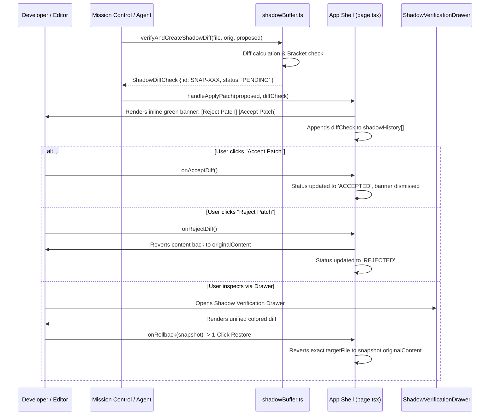

# Detailed Inspection: Part 2 — Verification, Shadow Buffers & Rollback Engine



---

## 1. Speculative Shadow Execution & Lifecycle

The Verification and Shadow Buffer Engine is designed to prevent destructive code overwrites by intercepting any AI or automated fast-path transformation, creating a speculative snapshot, and providing 1-click rollback.

### The Lifecycle States of a Shadow Snapshot:
- `PENDING`: Patch applied to the editor, awaiting developer review via the inline banner.
- `ACCEPTED`: Developer confirmed the patch; changes are retained in the document.
- `REJECTED`: Developer rejected the patch; editor immediately reverts to `originalContent`.
- `ROLLED_BACK`: A previously accepted or historical patch was undone via the 1-Click Restore button in the verification drawer.

---

## 2. Component-by-Component In-Depth Inspection

### A. Shadow Buffer Diff & Verification Engine
**File**: [`src/lib/verification/shadowBuffer.ts`](file:///Users/alpha/Desktop/antigavity/DBC/src/lib/verification/shadowBuffer.ts)

* **Diff Generation**:
  - Takes `targetFile`, `originalContent`, and `proposedContent`.
  - Splits contents by newline (`split('\n')`).
  - Iterates up to `maxLen = Math.max(originalLines.length, proposedLines.length)`.
  - Flags differences with `- orig` and `+ prop` prefixes.
* **Pre-Execution Syntax & Bracket Balance Check**:
  ```ts
  const openBrackets = (proposedContent.match(/[{[(]/g) || []).length;
  const closeBrackets = (proposedContent.match(/[}\])]/g) || []).length;
  const syntaxCheckPassed = Math.abs(openBrackets - closeBrackets) <= 2;
  ```
  - Calculates balance between `{, [, (` and `}, ], )`.
  - Sets `lspDiagnosticsCount = syntaxCheckPassed ? 0 : 2`.

---

### B. Inline Editor Verification Banner
**File**: [`src/components/CodeEditor.tsx:96-123`](file:///Users/alpha/Desktop/antigavity/DBC/src/components/CodeEditor.tsx#L96-L123)

* Renders above the Monaco Editor canvas when `activeDiff` is non-null:
  - Visual styling: Deep green container (`bg-[#143a22]`), sparkle icon, snapshot ID.
  - Interactive buttons:
    - `Reject Patch` (`bg-rose-950/60 text-rose-200 border-rose-500/40`) calling `onRejectDiff`.
    - `Accept Patch` (`bg-emerald-600 text-white`) calling `onAcceptDiff`.

---

### C. Shadow Verification & Rollback Hub (Drawer)
**File**: [`src/components/ShadowVerificationDrawer.tsx`](file:///Users/alpha/Desktop/antigavity/DBC/src/components/ShadowVerificationDrawer.tsx)

* **Layout & Navigation**:
  - Right-side sliding drawer (`max-w-3xl`) triggered from Activity Bar or Command Palette.
  - **Left pane**: Chronological snapshot stack displaying snapshot IDs, target file paths, relative timestamps, and color-coded status pills (`bg-amber-500/20 text-amber-400` vs `bg-emerald-500/20 text-emerald-400`).
  - **Right pane**:
    - Header with file name, snapshot ID, and `1-Click Restore` button (or `✓ Snapshot Restored` badge if already rolled back).
    - Unified Diff Terminal Viewer: Highlights `+` lines with green background (`bg-diff-addBg`) and `-` lines with red background (`bg-diff-delBg`).

---

### D. App Shell State Wiring
**File**: [`src/app/page.tsx:638-672`](file:///Users/alpha/Desktop/antigavity/DBC/src/app/page.tsx#L638-L672) & [`src/app/page.tsx:802-805`](file:///Users/alpha/Desktop/antigavity/DBC/src/app/page.tsx#L802-L805)

* State hooks:
  - `activeDiff`: `ShadowDiffCheck | null` (current speculative diff under review).
  - `shadowHistory`: `ShadowDiffCheck[]` (array of historical snapshots).
* Current handlers:
  - `handleApplyPatch`: Updates editor content, sets `activeDiff`, pushes to `shadowHistory`.
  - `handleRollbackSnapshot`: Reverts content, marks status as `ROLLED_BACK`.
  - `onAcceptDiff`: Clears `activeDiff`.
  - `onRejectDiff`: Clears `activeDiff`.

---

## 🚨 Critical Findings & Flaws Identified in Part 2

### 🔴 Finding 1 (Critical): "Reject Patch" Does Not Revert Editor Content
* **Severity**: 🔴 Critical
* **Files**: [`src/app/page.tsx:803-804`](file:///Users/alpha/Desktop/antigavity/DBC/src/app/page.tsx#L803-L804)
* **Problem**:
  ```tsx
  onAcceptDiff={() => setActiveDiff(null)}
  onRejectDiff={() => setActiveDiff(null)}
  ```
  When `handleApplyPatch(newContent, diffCheck)` was executed, `handleContentChange(newContent)` **already altered the editor buffer**. When the user clicks **Reject Patch**, `onRejectDiff` merely sets `activeDiff = null`. It **never reverts `activeFile.content` back to `activeDiff.originalContent`**!
* **Impact**:
  Clicking "Reject Patch" permanently keeps the rejected, speculative, or broken code in the user's active file. The user has no way to dismiss unwanted code changes without manual undo.
* **Fix**:
  ```tsx
  const handleRejectDiff = () => {
    if (!activeDiff) return;
    handleContentChange(activeDiff.originalContent);
    setShadowHistory(prev => prev.map(s => s.id === activeDiff.id ? { ...s, status: 'REJECTED' } : s));
    setActiveDiff(null);
    addToast('info', `Rejected patch ${activeDiff.id}; reverted editor changes.`);
  };
  ```

---

### 🔴 Finding 2 (Critical): Rollback Overwrites Current Active File Instead of Target File
* **Severity**: 🔴 Critical
* **Files**: [`src/app/page.tsx:668-672`](file:///Users/alpha/Desktop/antigavity/DBC/src/app/page.tsx#L668-L672)
* **Problem**:
  ```tsx
  const handleRollbackSnapshot = (diffCheck: ShadowDiffCheck) => {
    handleContentChange(diffCheck.originalContent);
    setShadowHistory((prev) => prev.map((s) => (s.id === diffCheck.id ? { ...s, status: 'ROLLED_BACK' } : s)));
    addToast('warning', `Rolled back to snapshot ${diffCheck.id}.`);
  };
  ```
  `handleContentChange` modifies `activeFile`. If the user is currently viewing `queries/orders.sql`, opens the Verification Drawer, and clicks "1-Click Restore" on a snapshot for `queries/users_report.sql`, `orders.sql` is silently overwritten with `users_report.sql`'s code!
* **Impact**:
  Silent cross-file corruption and data loss.
* **Fix**:
  Search `workspaceFiles` recursively for `diffCheck.targetFile`. Update that specific file's content in the tree and in `openFiles`. If `activeFile?.path === diffCheck.targetFile`, update `activeFile` as well.

---

### ⚠️ Finding 3 (High): Naive Line Comparison Produces Massive False Diff Cascades
* **Severity**: ⚠️ High
* **Files**: [`src/lib/verification/shadowBuffer.ts:17-27`](file:///Users/alpha/Desktop/antigavity/DBC/src/lib/verification/shadowBuffer.ts#L17-L27)
* **Problem**:
  The diff loop compares lines by direct index: `originalLines[i] !== proposedLines[i]`. If a single line is added at the start of a 200-line file, all subsequent 199 lines are out of alignment. The diff viewer reports 199 deletions and 200 additions instead of 1 addition.
* **Impact**:
  The unified diff view in `ShadowVerificationDrawer` becomes unreadable and unusable for insertions or deletions that shift line numbers.
* **Fix**:
  Implement a block-matching or Longest Common Subsequence (LCS) diff generator to produce standard hunk-aligned diffs.

---

### ⚠️ Finding 4 (Medium): Permissive Bracket Balance Check (`<= 2`) Allows Broken Syntax
* **Severity**: ⚠️ Medium
* **Files**: [`src/lib/verification/shadowBuffer.ts:32`](file:///Users/alpha/Desktop/antigavity/DBC/src/lib/verification/shadowBuffer.ts#L32)
* **Problem**:
  `const syntaxCheckPassed = Math.abs(openBrackets - closeBrackets) <= 2;`
  A threshold of `<= 2` allows code with 2 missing closing braces or unclosed parentheses to be declared syntactically valid with `lspDiagnosticsCount: 0`.
* **Impact**:
  Invalid syntax bypasses pre-execution verification and is accepted into the workspace.
* **Fix**:
  Set threshold strictly to `=== 0` (`openBrackets === closeBrackets`).

---

### ⚠️ Finding 5 (Medium): `routerEngine.ts` Bypasses `verifyAndCreateShadowDiff`
* **Severity**: ⚠️ Medium
* **Files**: [`src/lib/router/routerEngine.ts:90-104`](file:///Users/alpha/Desktop/antigavity/DBC/src/lib/router/routerEngine.ts#L90-L104)
* **Problem**:
  When Mission Control dispatches a prompt via `executeRoutedPrompt`, it manually constructs a dummy `ShadowDiffCheck` object where `patchDiff` is hardcoded to `+ // Routed via ...` rather than calling `verifyAndCreateShadowDiff`.
* **Impact**:
  Snapshots created through Mission Control lack real unified diff output and syntax verification checks in the verification drawer.
* **Fix**:
  Invoke `verifyAndCreateShadowDiff(targetFile, currentContent, proposedContent)` inside `routerEngine.ts`.

---

### 💡 Finding 6 (Low): Dead State & Unpersisted History
* **Severity**: 💡 Low
* **Files**: [`src/components/ShadowVerificationDrawer.tsx:21`](file:///Users/alpha/Desktop/antigavity/DBC/src/components/ShadowVerificationDrawer.tsx#L21) & [`src/lib/workspacePersistence.ts:6-13`](file:///Users/alpha/Desktop/antigavity/DBC/src/lib/workspacePersistence.ts#L6-L13)
* **Problem**:
  1. `const [viewMode, setViewMode] = useState<'unified' | 'sideBySide'>('unified')` is dead state — side-by-side mode has no toggle UI.
  2. `shadowHistory` is omitted from `PersistedWorkspaceData`, so refreshing the browser wipes the snapshot history clean despite the presence of an "Auto-Save Shadow Buffers" setting in `SettingsModal.tsx`.
* **Fix**:
  Persist `shadowHistory` in localStorage under `dbc_shadow_history_v1` and implement the side-by-side split diff toggle.

---

## 🛠️ Implementation Plan for Part 2 Fixes

1. **Revert on Reject & Status Management**:
   - Implement `handleRejectDiff` in `page.tsx` restoring `activeDiff.originalContent` and updating status to `'REJECTED'`.
   - Implement `handleAcceptDiff` in `page.tsx` marking snapshot status as `'ACCEPTED'`.
2. **Safe Multi-File Rollback**:
   - Refactor `handleRollbackSnapshot` to look up the exact target file by path in `workspaceFiles` instead of blindly overwriting `activeFile`.
3. **LCS Unified Diff & Strict Syntax Verification**:
   - Upgrade `shadowBuffer.ts` with an LCS-based diff generator and strict `=== 0` bracket verification.
4. **Wire Router to `verifyAndCreateShadowDiff`**:
   - Replace manual dummy object creation in `routerEngine.ts` with `verifyAndCreateShadowDiff`.
