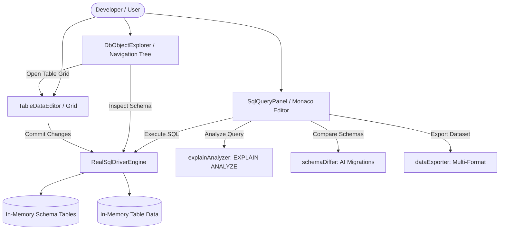

# Detailed Inspection: Part 3 — SQL Engine, Relational Driver & EXPLAIN Analyzer

```text
    ┌─────────────────────────── Relational SQL Subsystem Architecture ───────────────────────────┐
    │                                                                                              │
    │   [ SqlQueryPanel ] ──────────► [ realSqlDriver (Engine) ]                                   │
    │         │                               │                                                    │
    │         ├─► [ ExplainPlanModal ]        ├─► Introspected Schema (users, roles)               │
    │         │         │                     ├─► Evaluators: WHERE, JOIN, ORDER BY, LIMIT         │
    │         │         ▼                     └─► In-Memory Row Storage & Mutators                 │
    │         │   [ explainAnalyzer ]                                                              │
    │         │                                                                                    │
    │         ├─► [ SchemaDiffModal ] ─────► [ schemaDiffer ] (UP/DOWN Migration Generator)        │
    │         │                                                                                    │
    │         ├─► [ DataExportWizard ] ────► [ dataExporter ] (XLS, CSV, JSON, MD, HTML)           │
    │         │                                                                                    │
    │         └─► [ TableDataEditor ] ─────► Direct Table Grid (Sorting, Filtering, Row CRUD)      │
    │                                                                                              │
    └──────────────────────────────────────────────────────────────────────────────────────────────┘
```



---

## 1. Subsystem Overview & Responsibilities

The DBC Relational Subsystem provides a lightweight, browser-native database management studio capable of executing SQL queries, managing relational schemas, inspecting execution plans, generating database migrations, and exporting datasets.

### Core Modules:
1. **[`src/lib/db/sqlDriver.ts`](file:///Users/alpha/Desktop/antigavity/DBC/src/lib/db/sqlDriver.ts)**:
   - In-memory relational engine supporting DDL (`CREATE TABLE`, `DROP TABLE`) and DML (`SELECT`, `INSERT`, `UPDATE`, `DELETE`).
   - Supports table introspection, `WHERE` condition parsing (`=`, `!=`, `<`, `>`, `<=`, `>=`, `LIKE`, `IS NULL`, `IS NOT NULL`), `INNER`/`LEFT JOIN`, `ORDER BY`, and `LIMIT`/`OFFSET`.
2. **[`src/lib/db/explainAnalyzer.ts`](file:///Users/alpha/Desktop/antigavity/DBC/src/lib/db/explainAnalyzer.ts)**:
   - Visual EXPLAIN ANALYZE parser calculating cost, execution duration, and row estimates.
   - Identifies sequential scan bottlenecks and recommends B-Tree index creation.
3. **[`src/lib/db/schemaDiffer.ts`](file:///Users/alpha/Desktop/antigavity/DBC/src/lib/db/schemaDiffer.ts)**:
   - Environment schema comparison generator producing forward `UP` and rollback `DOWN` SQL migration scripts.
   - Issues `CRITICAL` warnings for data-destructive actions (e.g. table drops).
4. **[`src/lib/db/dataExporter.ts`](file:///Users/alpha/Desktop/antigavity/DBC/src/lib/db/dataExporter.ts)**:
   - Serializes query results into Excel XML (`.xls`), RFC-4180 CSV (`.csv`), JSON (`.json`), GitHub Markdown (`.md`), and HTML table formats.
   - Handles client-side file triggers.
5. **Component Studio Layer**:
   - [`SqlQueryPanel.tsx`](file:///Users/alpha/Desktop/antigavity/DBC/src/components/SqlQueryPanel.tsx), [`DbObjectExplorer.tsx`](file:///Users/alpha/Desktop/antigavity/DBC/src/components/DbObjectExplorer.tsx), [`DbConnectionPanel.tsx`](file:///Users/alpha/Desktop/antigavity/DBC/src/components/DbConnectionPanel.tsx), [`TableDataEditor.tsx`](file:///Users/alpha/Desktop/antigavity/DBC/src/components/TableDataEditor.tsx), [`TableInspectorModal.tsx`](file:///Users/alpha/Desktop/antigavity/DBC/src/components/TableInspectorModal.tsx), [`TableCreatorModal.tsx`](file:///Users/alpha/Desktop/antigavity/DBC/src/components/TableCreatorModal.tsx), [`ExplainPlanModal.tsx`](file:///Users/alpha/Desktop/antigavity/DBC/src/components/ExplainPlanModal.tsx), [`SchemaDiffModal.tsx`](file:///Users/alpha/Desktop/antigavity/DBC/src/components/SchemaDiffModal.tsx), [`DataExportWizard.tsx`](file:///Users/alpha/Desktop/antigavity/DBC/src/components/DataExportWizard.tsx), [`DbPerformanceMonitor.tsx`](file:///Users/alpha/Desktop/antigavity/DBC/src/components/DbPerformanceMonitor.tsx).

---

## 2. In-Depth Component Analysis & Findings

### Finding 1: Critical — Severe Data Corruption on Filtered/Sorted Edits in `TableDataEditor`
* **File**: [`src/components/TableDataEditor.tsx:46-58, 74-86, 202-235`](file:///Users/alpha/Desktop/antigavity/DBC/src/components/TableDataEditor.tsx#L46-L58)
* **Severity**: 🔴 Critical
* **Trace**:
  1. `filteredRows` filters rows matching `searchTerm`.
  2. `sortedRows` sorts `filteredRows` by `sortCol`.
  3. In table rendering:
     ```tsx
     {sortedRows.map((row, rIdx) => {
       ...
       <input onChange={(e) => handleCellChange(rIdx, col, e.target.value)} />
     ```
  4. In `handleCellChange`:
     ```ts
     const handleCellChange = (rowIdx: number, colName: string, value: any) => {
       const updated = [...rows];
       updated[rowIdx] = { ...updated[rowIdx], [colName]: value };
       setRows(updated);
       setPendingChanges(true);
     };
     ```
  5. In `handleDeleteSelected`:
     ```ts
     const handleDeleteSelected = () => {
       const remaining = rows.filter((_, idx) => !selectedRows.includes(idx));
       setRows(remaining);
       setSelectedRows([]);
       setPendingChanges(true);
     };
     ```
* **Impact**:
  - `rIdx` is the index within the **filtered & sorted** view, whereas `handleCellChange` and `handleDeleteSelected` index directly into the unfiltered raw `rows` array.
  - If a user filters for a specific user (e.g. searching for `alpha`) and edits row 0 in the view, it updates row 0 in `rows` (which is `admin`), corrupting unrelated records.
  - Deleting selected rows when filtered deletes wrong rows from the database.
* **Remediation**:
  - Store a stable identity/key (e.g., `row.__rowId` or primary key `id`) and look up the target row index in `rows` by ID rather than relying on the view loop index.

---

### Finding 2: Critical — Phantom Persistence in `SqlQueryPanel` Inline Cell Editing
* **File**: [`src/components/SqlQueryPanel.tsx:102-122`](file:///Users/alpha/Desktop/antigavity/DBC/src/components/SqlQueryPanel.tsx#L102-L122)
* **Severity**: 🔴 Critical
* **Trace**:
  1. The user double-clicks cells in the query result table and modifies values, accumulating `pendingEdits`.
  2. The user clicks the pulsating **"Save X Edits"** button, invoking `handleCommitEdits()`.
  3. `handleCommitEdits()` updates the local React state `queryResult.rows`:
     ```ts
     setQueryResult({ ...queryResult, rows: updatedRows });
     setPendingEdits({});
     if (onLogTerminal) {
       onLogTerminal(`[DBC Data Editor]: Auto-generated & executed UPDATE statements for ${editCount} cell modification(s).`);
     }
     ```
* **Impact**:
  - The component logs that it generated and executed SQL `UPDATE` statements, but **no SQL query or database driver update is ever called**.
  - `realSqlDriver.setTableData()` is never invoked.
  - As soon as the user executes another query or navigates away, all "saved" edits disappear permanently.
* **Remediation**:
  - Generate and execute real `UPDATE <table> SET <col> = <val> WHERE <pk> = <id>` statements through `realSqlDriver.executeQuery()`, or sync mutated rows to `realSqlDriver.setTableData()`.

---

### Finding 3: High — Semicolon Terminators Cause `UPDATE` and `DELETE` Queries to Silently Fail
* **File**: [`src/lib/db/sqlDriver.ts:301, 342`](file:///Users/alpha/Desktop/antigavity/DBC/src/lib/db/sqlDriver.ts#L301)
* **Severity**: 🟠 High
* **Trace**:
  1. `UPDATE` parsing regex:
     ```ts
     const match = cleanSql.match(/UPDATE\s+([a-zA-Z0-9_]+)\s+SET\s+([\s\S]+?)(?:\s+WHERE\s+([\s\S]+))?$/i);
     ```
  2. If the user runs standard SQL terminated with a semicolon:
     `UPDATE users SET role_id = 2 WHERE id = 1;`
  3. Group 3 captures `"1;"`.
  4. In `evaluateWhereCondition`:
     - `trimmed` is `"id = 1;"`.
     - `rawVal` becomes `"1;"`.
     - `Number("1;")` evaluates to `NaN`.
     - `isNumeric` evaluates to `false`.
     - `String(cellVal).toLowerCase() === rawVal.toLowerCase()` evaluates `1` === `"1;"` which is `false`.
  5. The query reports 0 affected rows.
  6. Similarly in `DELETE FROM users;` (no WHERE clause, but ends with `;`), regex fails to match due to `$`, falling back to `{ status: 'OK' }` without deleting any records.
* **Impact**:
  - Any standard `UPDATE` or `DELETE` query ending in `;` fails to match rows or execute, returning 0 affected rows without warning.
* **Remediation**:
  - Sanitize `cleanSql` at the entry of `executeQuery` by stripping trailing semicolons: `cleanSql.replace(/;+\s*$/, '').trim()`.

---

### Finding 4: High — Omission of Dropped Column Detection in `schemaDiffer`
* **File**: [`src/lib/db/schemaDiffer.ts:47-59, 72`](file:///Users/alpha/Desktop/antigavity/DBC/src/lib/db/schemaDiffer.ts#L47-L59)
* **Severity**: 🟠 High
* **Trace**:
  1. When computing schema differences:
     ```ts
     targetTables.forEach(tTable => {
       ...
       tTable.columns.forEach(tCol => {
         if (!sColMap.has(tCol.name)) {
           addedColumns.push({ table: tTable.name, colName: tCol.name, type: tCol.type });
           upSqlLines.push(`ALTER TABLE ${tTable.name} ADD COLUMN ${tCol.name} ${tCol.type};`);
           downSqlLines.push(`ALTER TABLE ${tTable.name} DROP COLUMN ${tCol.name};`);
         }
       });
     });
     ```
  2. The loop only iterates through `targetTables` to find columns missing in `sourceTable`.
  3. It **never** iterates through `sTable.columns` to find columns present in `sourceTable` but removed in `targetTable`.
* **Impact**:
  - Dropped columns are completely invisible to the diff engine.
  - No `ALTER TABLE ... DROP COLUMN` is generated for the forward `UP` script.
  - No `CRITICAL` safety warning is raised when a column is deleted, risking unnoticed production schema drift.
  - Furthermore, in line 72, DOWN rollback for dropped tables generates `CREATE TABLE` without `PRIMARY KEY` constraints.
* **Remediation**:
  - Add bidirectional column diffing: iterate `sTable.columns` against `tColMap` to detect dropped columns and append safety warnings.

---

### Finding 5: Medium — Naive Comma Splitting Destroys Quoted Strings and Precision Types
* **File**: [`src/lib/db/sqlDriver.ts:138, 168, 308`](file:///Users/alpha/Desktop/antigavity/DBC/src/lib/db/sqlDriver.ts#L138)
* **Severity**: 🟡 Medium
* **Trace**:
  - Column definitions: `body.split(',')` breaks data types with precision commas (e.g. `DECIMAL(10, 2)` or `NUMERIC(8, 4)`).
  - INSERT values: `rawValues = match[4].split(',').map(...)` breaks any string containing a comma (e.g. `VALUES ('Doe, Jane', 'jane@dbc.org')`), shifting column values into wrong fields.
  - `CREATE TABLE IF NOT EXISTS` breaks because `CREATE TABLE ([a-zA-Z0-9_]+)` captures `"IF"` as the table name.
* **Impact**:
  - Queries containing formatted strings or precision datatypes fail or corrupt data upon insertion.
* **Remediation**:
  - Use regex that respects quotes or a balanced delimiter tokenizer when splitting SQL arguments. Support `CREATE TABLE (IF NOT EXISTS )?`.

---

### Finding 6: Medium — Phantom "Run SELECT Top 100" Action in `DbObjectExplorer`
* **File**: [`src/app/page.tsx:743-746`](file:///Users/alpha/Desktop/antigavity/DBC/src/app/page.tsx#L743-L746)
* **Severity**: 🟡 Medium
* **Trace**:
  ```tsx
  onRunSelectTop={(tableName) => {
    setActiveView('database');
    handleLogTerminal(`[DBMS Editor]: Executed SELECT * FROM ${tableName} LIMIT 100;`);
  }}
  ```
* **Impact**:
  - Clicking the play button beside a table in the database sidebar logs a simulated terminal message, but never sets the query in `SqlQueryPanel` and never runs the query against `realSqlDriver`.
  - The main editor view remains on whatever previous query was loaded.
* **Remediation**:
  - Pass a callback or event that updates `query` in `SqlQueryPanel` and immediately triggers `handleExecuteQuery("SELECT * FROM <tableName> LIMIT 100;")`.

---

### Finding 7: Medium — JOIN Column Overwrites & Hardcoded Index Suggestions
* **File**: [`src/lib/db/sqlDriver.ts:222`](file:///Users/alpha/Desktop/antigavity/DBC/src/lib/db/sqlDriver.ts#L222), [`src/lib/db/explainAnalyzer.ts:60-65`](file:///Users/alpha/Desktop/antigavity/DBC/src/lib/db/explainAnalyzer.ts#L60-L65)
* **Severity**: 🟡 Medium
* **Trace**:
  - In `sqlDriver.ts`:
    ```ts
    joinedRows.push({ ...mainRow, ...m });
    ```
    If `users` has `id` and `roles` has `id`, `{ ...mainRow, ...m }` overwrites `users.id` with `roles.id`. The resulting dataset loses the user primary key.
  - In `explainAnalyzer.ts`:
    The AI Index Advisor statically recommends:
    `CREATE INDEX idx_${tableName}_email ON ${tableName}(email);`
    Regardless of whether the WHERE condition filtered on `id`, `username`, or `created_at`, the suggestion always targets `email`.
* **Impact**:
  - Ambiguous column names in relational joins overwrite main entity identifiers.
  - AI index recommendations ignore actual queried columns.
* **Remediation**:
  - Prefix duplicate join columns with table names or qualify them (`users.id`, `roles.id`).
  - Extract the column name present in the query's `WHERE` clause to recommend an index on the actual filtered attribute.

---

## 3. Subsystem Roadmap & Status

| Subsystem | Scope | Status |
| :--- | :--- | :--- |
| **Part 1: Routing Engine** | Router config, heuristic classifier, BYOK fallback, latency tracker | ✅ Completed |
| **Part 2: Verification Engine** | Shadow buffers, diff engine, inline banners, rollback drawer | ✅ Completed |
| **Part 3: SQL Relational Driver** | In-memory engine, EXPLAIN analyzer, schema differ, data exporter | ✅ Completed |
| **Part 4: Agentic AI & BYOK** | Multi-provider streaming, context windowing, agent plan loop | ⏳ Next |
| **Part 5: Workspace State & FS** | Virtual file tree, hydration, localStorage sync, active tab | ⏳ Pending |
| **Part 6: Monaco Code Editor** | Custom syntax themes, keybindings, minimap, multi-tab | ⏳ Pending |
| **Part 7: Terminal & IPC Rust** | Terminal ANSI renderer, pseudo-shell, IPC sidecar bridge | ⏳ Pending |
