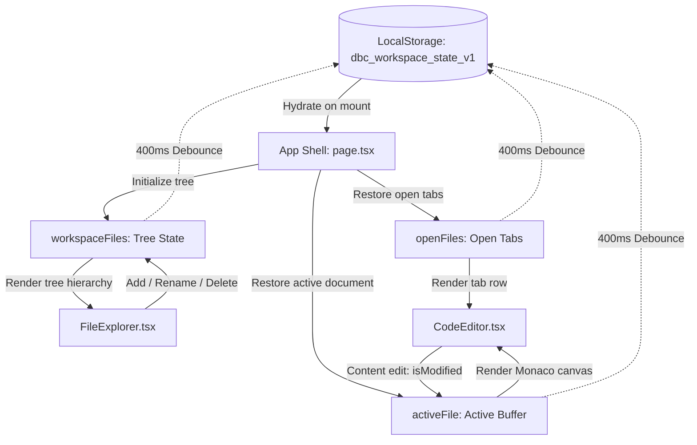

# Detailed Inspection: Part 5 — Workspace State, File Tree, Hydration & Persistence

```text
    ┌─────────────────────────── Workspace & Persistence Architecture ───────────────────────────┐
    │                                                                                             │
    │   [ LocalStorage ] (dbc_workspace_state_v1)                                                 │
    │          │                                                                                  │
    │          ├─► loadPersistedWorkspace() ──► Hydrate on Mount                                  │
    │          │                                      │                                           │
    │          │                                      ▼                                           │
    │          │                            [ App Shell (page.tsx) ]                              │
    │          │                                 │          │                                     │
    │          │                ┌────────────────┴──┐       └───┐                                 │
    │          │                ▼                   ▼           ▼                                 │
    │          │       workspaceFiles        openFiles     activeFile                             │
    │          │        (Tree Nodes)         (Tab Bar)     (Editor Buffer)                        │
    │          │                │                   │           │                                 │
    │          │                ▼                   ▼           ▼                                 │
    │          │         [ FileExplorer ]      [ CodeEditor: Tab Bar & Monaco ]                   │
    │          │                                                                                  │
    │          └◄─ 400ms Debounce Auto-Save ◄─ [ State Mutators: Add/Delete/Rename/Edit ]         │
    │                                                                                             │
    └─────────────────────────────────────────────────────────────────────────────────────────────┘
```



---

## 1. Subsystem Overview & Responsibilities

The Workspace State & Persistence Subsystem manages the virtual file system hierarchy, active document tabs, editor buffers, and bidirectional synchronization with browser `localStorage`.

### Core Modules:
1. **[`src/lib/workspacePersistence.ts`](file:///Users/alpha/Desktop/antigavity/DBC/src/lib/workspacePersistence.ts)** (101 lines):
   - Handles serialization and deserialization of `PersistedWorkspaceData` under key `dbc_workspace_state_v1`.
   - Provides tree utility functions: `findFileNodeById(nodes, id)` and `flattenFileNodes(nodes)`.
2. **[`src/lib/initialWorkspace.ts`](file:///Users/alpha/Desktop/antigavity/DBC/src/lib/initialWorkspace.ts)** (74 lines):
   - Default fallback workspace tree containing `queries/` (`users_report.sql`, `slow_queries_check.sql`), `migrations/` (`001_initial_schema.sql`), `src/` (`index.ts`, `dbConfig.json`), and `README.md`.
3. **[`src/components/FileExplorer.tsx`](file:///Users/alpha/Desktop/antigavity/DBC/src/components/FileExplorer.tsx)** (262 lines):
   - Tree navigation component supporting collapsible folders, file icon mappings, inline rename forms, hover deletion buttons, and target-directory creation.
4. **[`src/components/SearchModal.tsx`](file:///Users/alpha/Desktop/antigavity/DBC/src/components/SearchModal.tsx)** (179 lines):
   - Global multi-file search and replace modal with regex, case sensitivity, and jump-to-line coordination.
5. **[`src/app/page.tsx`](file:///Users/alpha/Desktop/antigavity/DBC/src/app/page.tsx)** (Central State Coordinator):
   - Holds primary state: `workspaceFiles`, `openFiles`, `activeFile`, `connections`, `activeConnectionId`.
   - Debounced auto-save effect (400ms timer).
   - CRUD handlers: `handleAddFile`, `handleAddFolder`, `handleDeleteFile`, `handleRenameFile`, `handleSaveScriptToWorkspace`, `handleReplaceAll`.

---

## 2. In-Depth Component Analysis & Findings

### Finding 1: Critical — `handleRenameFile` Updates `name` but Leaves `path` and Open Tabs Desynchronized
* **File**: [`src/app/page.tsx:568-577`](file:///Users/alpha/Desktop/antigavity/DBC/src/app/page.tsx#L568-L577)
* **Severity**: 🔴 Critical
* **Trace**:
  ```ts
  const handleRenameFile = (fileId: string, newName: string) => {
    const updateTree = (nodes: FileNode[]): FileNode[] =>
      nodes.map(n => {
        if (n.id === fileId) return { ...n, name: newName };
        if (n.isFolder && n.children) return { ...n, children: updateTree(n.children) };
        return n;
      });
    setWorkspaceFiles(prev => updateTree(prev));
    addToast('info', `Renamed file to ${newName}`);
  };
  ```
  1. When a user renames `queries/users_report.sql` to `customers.sql`, only `n.name` is changed.
  2. `n.path` is **never updated** and remains `queries/users_report.sql`.
  3. `activeFile` is not updated if the file is currently active.
  4. `openFiles` is not updated, leaving the old name and path in the open tab bar.
  5. If a folder is renamed, neither the folder's `path` nor any of its recursive children's `path` properties are updated.
* **Impact**:
  - Split-brain state: The file explorer shows `customers.sql`, but the editor tab displays the old file name.
  - Any downstream features relying on `file.path` (e.g. Monaco language detection, symbol jumps, diff targets) receive outdated paths.
* **Remediation**:
  - Calculate the new path by replacing the trailing file name in `n.path`.
  - Update matching entries in `openFiles` and `activeFile`.
  - For folders, recursively rewrite the prefix path of all nested children.

---

### Finding 2: Critical — `handleSaveScriptToWorkspace` Pushes Queries to Root Instead of `queries/` Folder
* **File**: [`src/app/page.tsx:579-590`](file:///Users/alpha/Desktop/antigavity/DBC/src/app/page.tsx#L579-L590)
* **Severity**: 🔴 Critical
* **Trace**:
  ```ts
  const handleSaveScriptToWorkspace = (scriptName: string, content: string) => {
    const newFile: FileNode = {
      id: `file-${Date.now()}`,
      name: scriptName,
      path: `queries/${scriptName}`,
      language: 'sql',
      content
    };
    setWorkspaceFiles(prev => [...prev, newFile]);
    addToast('success', `Saved SQL script ${scriptName} to workspace queries/ folder.`);
  };
  ```
  1. The user creates a script from the SQL Query Panel via "Save Script to Workspace".
  2. The code constructs a node with `path: queries/${scriptName}`.
  3. However, it calls `setWorkspaceFiles(prev => [...prev, newFile])`, appending `newFile` to the **root array** of `workspaceFiles`.
* **Impact**:
  - The file appears as an unorganized root-level item in the file explorer tree, directly contradicting the user-facing toast and log message that claimed it was saved to the `queries/` folder.
* **Remediation**:
  - Use tree traversal to insert the file into the `children` array of the `queries` folder node (`node.path === 'queries'`), creating the folder if it does not exist.

---

### Finding 3: Critical — Unsaved In-Memory Editor Buffer Flushed to LocalStorage on Auto-Save
* **File**: [`src/app/page.tsx:186-197, 476-481`](file:///Users/alpha/Desktop/antigavity/DBC/src/app/page.tsx#L186-L197)
* **Severity**: 🔴 Critical
* **Trace**:
  1. When a user types in Monaco Editor, `handleContentChange` updates `activeFile.content` and `openFiles`.
  2. `workspaceFiles` is **only updated when the user explicitly triggers `handleSaveActiveFile`** (`Ctrl+S`).
  3. However, the debounced auto-save effect persists `workspaceFiles` to `localStorage`:
     ```ts
     savePersistedWorkspace({
       files: workspaceFiles,
       activeFileId: activeFile?.id || null,
       openFileIds: openFiles.map((f) => f.id),
       connections,
       activeConnectionId
     });
     ```
  4. When the page is reloaded, `loadPersistedWorkspace()` hydrates `workspaceFiles` from `localStorage` and looks up `activeFile` inside `saved.files` via `findFileNodeById(saved.files, saved.activeFileId)`.
* **Impact**:
  - Because `workspaceFiles` was never updated with the in-progress buffer, all unsaved edits are **wiped out on page refresh**, even though `activeFileId` and `openFileIds` were successfully restored.
* **Remediation**:
  - Either sync active editor changes into `workspaceFiles` during `handleContentChange` (or debounced), or store unsaved open file buffers in `PersistedWorkspaceData.openFiles` so in-progress drafts are preserved across reloads.

---

### Finding 4: High — Zombie Tabs Retained in `openFiles` on Folder Deletion
* **File**: [`src/app/page.tsx:592-598`](file:///Users/alpha/Desktop/antigavity/DBC/src/app/page.tsx#L592-L598)
* **Severity**: 🟠 High
* **Trace**:
  ```ts
  const handleDeleteFile = (fileId: string) => {
    const filterTree = (nodes: FileNode[]): FileNode[] =>
      nodes.filter((n) => n.id !== fileId).map((n) => (n.children ? { ...n, children: filterTree(n.children) } : n));
    setWorkspaceFiles((prev) => filterTree(prev));
    handleCloseTab(fileId);
    addToast('info', 'File deleted from workspace.');
  };
  ```
  1. When a user deletes a folder (e.g. `folder-queries`), `handleCloseTab(fileId)` only closes a tab whose ID strictly equals `folder-queries`.
  2. If the user had `users_report.sql` or `slow_queries_check.sql` open in tabs, their tabs remain open in `openFiles`.
* **Impact**:
  - The tab bar retains "zombie" tabs pointing to deleted files.
  - Attempting to save these tabs fails silently because the parent folder and node no longer exist in `workspaceFiles`.
* **Remediation**:
  - When deleting a folder, gather all descendant file IDs (using `flattenFileNodes(deletedFolder.children)`) and close all matching tabs from `openFiles`.

---

### Finding 5: High — Folder Collapse Key Mismatch (`queries` vs `folder-queries`)
* **File**: [`src/components/FileExplorer.tsx:30-41`](file:///Users/alpha/Desktop/antigavity/DBC/src/components/FileExplorer.tsx#L30-L41)
* **Severity**: 🟠 High
* **Trace**:
  1. `FileExplorer.tsx` initializes `openFolders` state with:
     ```ts
     const [openFolders, setOpenFolders] = useState<Record<string, boolean>>({
       queries: true,
       migrations: true,
       src: true
     });
     ```
  2. However, the actual folder IDs defined in `INITIAL_WORKSPACE` are:
     - `'folder-queries'`
     - `'folder-migrations'`
     - `'folder-src'`
  3. When the user clicks the collapse arrow on `queries`:
     - Node ID is `'folder-queries'`.
     - `openFolders['folder-queries']` is `undefined`.
     - `toggleFolder` executes `!prev['folder-queries']`, which evaluates `!undefined` to `true`.
     - `openFolders['folder-queries']` is set to `true`.
* **Impact**:
  - Clicking the folder collapse arrow on initial load **fails to collapse the folder**. The user must click a second time before the folder finally collapses.
* **Remediation**:
  - Match initial state keys to `'folder-queries'`, `'folder-migrations'`, `'folder-src'`, or default to checking `prev[folderId] ?? true` and inverting `!(prev[folderId] ?? true)`.

---

### Finding 6: Medium — Unescaped Regex Crash in Global Search & Replace
* **File**: [`src/app/page.tsx:605`](file:///Users/alpha/Desktop/antigavity/DBC/src/app/page.tsx#L605), [`src/components/SearchModal.tsx:71-76`](file:///Users/alpha/Desktop/antigavity/DBC/src/components/SearchModal.tsx#L71-L76)
* **Severity**: 🟡 Medium
* **Trace**:
  1. In `SearchModal.tsx`, `isRegex` and `isMatchCase` toggles exist, but `onReplaceAll(searchTerm, replaceTerm)` only passes raw strings.
  2. In `page.tsx`:
     ```ts
     node.content.replace(new RegExp(searchTerm, 'g'), replaceTerm)
     ```
  3. `new RegExp(searchTerm, 'g')` is called without escaping regex metacharacters.
  4. If a user replaces strings like `COUNT(*)`, `db.query()`, or `$state`, JavaScript throws an uncaught `SyntaxError: Invalid regular expression: nothing to repeat`.
  5. Furthermore, `handleReplaceAll` updates `workspaceFiles`, but fails to update `activeFile` and `openFiles`, leaving stale editor buffers that overwrite the replacement upon next save.
* **Impact**:
  - Replacing standard SQL or code syntax containing parentheses, dots, or asterisks crashes the replacement pipeline.
  - Open editor tabs become desynchronized and overwrite replacements.
* **Remediation**:
  - Escape regex metacharacters when regex mode is disabled (`searchTerm.replace(/[.*+?^${}()|[\]\\]/g, '\\$&')`).
  - Synchronize updated contents into `openFiles` and `activeFile`.

---

### Finding 7: Low — Unpersisted UI Session States
* **File**: [`src/lib/workspacePersistence.ts:6-13`](file:///Users/alpha/Desktop/antigavity/DBC/src/lib/workspacePersistence.ts#L6-L13)
* **Severity**: 💡 Low
* **Trace**:
  1. `PersistedWorkspaceData` omits:
     - `activeView` (`'database' | 'explorer' | 'analytics'`)
     - `openFolders` (folder expansion map)
     - `terminalLogs`
     - `shadowHistory`
* **Impact**:
  - Refreshing the application resets the active view to `'database'`, expands all folders, and clears verification history and terminal logs.
* **Remediation**:
  - Expand `PersistedWorkspaceData` schema to preserve active view and UI layout preferences across sessions.

---

## 3. Subsystem Roadmap & Status

| Subsystem | Scope | Status |
| :--- | :--- | :--- |
| **Part 1: Routing Engine** | Router config, heuristic classifier, BYOK fallback, latency tracker | ✅ Completed |
| **Part 2: Verification Engine** | Shadow buffers, diff engine, inline banners, rollback drawer | ✅ Completed |
| **Part 3: SQL Relational Driver** | In-memory engine, EXPLAIN analyzer, schema differ, data exporter | ✅ Completed |
| **Part 4: Agentic AI & BYOK** | Multi-provider streaming, context windowing, agent plan loop | ✅ Completed |
| **Part 5: Workspace State & FS** | Virtual file tree, hydration, localStorage sync, active tab | ✅ Completed |
| **Part 6: Monaco Code Editor** | Custom syntax themes, keybindings, minimap, multi-tab | ⏳ Next |
| **Part 7: Terminal & IPC Rust** | Terminal ANSI renderer, pseudo-shell, IPC sidecar bridge | ⏳ Pending |
