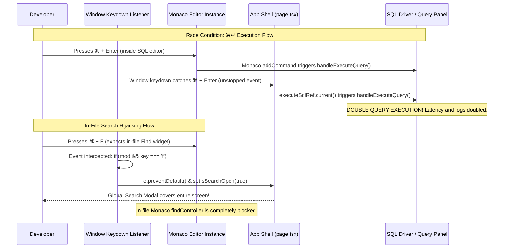

# Detailed Inspection: Part 6 — Monaco Code Editor, Custom Themes & Keybindings

```text
    ┌─────────────────────────── Monaco & Keybinding Architecture ───────────────────────────┐
    │                                                                                         │
    │   [ Global Keydown Dispatcher (window) ]                                                │
    │          │                                                                              │
    │          ├─► ⌘P / ⌘K ──────► [ CommandPalette.tsx ] (Fuzzy actions & navigation)        │
    │          ├─► ⌘/ ───────────► [ ShortcutsModal.tsx ] (Cheat sheet modal)                 │
    │          ├─► ⌘F (Hijacked) ► [ SearchModal.tsx ] (Blocks Monaco in-file Find!)          │
    │          ├─► ⌘↵ ───────────► [ Dual Execution! ] (Runs in page.tsx AND Monaco!)         │
    │          ├─► ⌘S ───────────► handleSaveActiveFile()                                     │
    │          └─► ⌘B / ⌘J / ⌘L ─► Toggle UI panels (Sidebar, Terminal, Copilot)              │
    │                                                                                         │
    │   [ Monaco Theme Provider (monacoThemes.ts) ]                                           │
    │          │                                                                              │
    │          ├─► defineMonacoThemes()                                                       │
    │          │   (vscode-dark, monokai, onedark, cyberpunk)                                 │
    │          │                                                                              │
    │          ├─► Monaco Canvas (CodeEditor.tsx & SqlQueryPanel.tsx) ──► THEMED              │
    │          │                                                                              │
    │          └─► IDE Application Shell (Sidebar, Tabs, Modals) ───────► UNTHEMED (Broken)  │
    │                                                                                         │
    └─────────────────────────────────────────────────────────────────────────────────────────┘
```



---

## 1. Subsystem Overview & Responsibilities

The Monaco Code Editor, Custom Themes & Keybindings Subsystem powers the code viewing and editing experience, syntax highlighting, theme switching, global command dispatching, and keyboard productivity.

### Core Modules:
1. **[`src/lib/monacoThemes.ts`](file:///Users/alpha/Desktop/antigavity/DBC/src/lib/monacoThemes.ts)** (81 lines):
   - Defines custom Monaco editor color themes: `vscode-dark`, `monokai`, `onedark`, `cyberpunk`.
   - Utility resolver: `getMonacoThemeName(theme)`.
2. **[`src/components/CodeEditor.tsx`](file:///Users/alpha/Desktop/antigavity/DBC/src/components/CodeEditor.tsx)** (161 lines):
   - Primary Monaco editor container rendered via dynamic SSR-disabled import (`@monaco-editor/react`).
   - Handles tab bar row, file modification badges, inline shadow verification banners, and font configurations.
3. **[`src/components/SqlQueryPanel.tsx`](file:///Users/alpha/Desktop/antigavity/DBC/src/components/SqlQueryPanel.tsx)**:
   - Secondary Monaco editor instance tailored for interactive SQL query formulation and execution.
4. **[`src/components/CommandPalette.tsx`](file:///Users/alpha/Desktop/antigavity/DBC/src/components/CommandPalette.tsx)** (155 lines):
   - Quick navigation palette with arrow-key traversal, category badges, and instant command dispatch.
5. **[`src/components/ShortcutsModal.tsx`](file:///Users/alpha/Desktop/antigavity/DBC/src/components/ShortcutsModal.tsx)** (106 lines):
   - Keyboard shortcuts cheat sheet organized across 4 functional categories.
6. **[`src/app/page.tsx:256-408`](file:///Users/alpha/Desktop/antigavity/DBC/src/app/page.tsx#L256-L408)**:
   - Window-level `keydown` event coordinator managing global shortcuts and action bindings.

---

## 2. In-Depth Component Analysis & Findings

### Finding 1: Critical — Double Query Execution on `⌘Enter` Due to Unstopped Keydown Bubbling
* **File**: [`src/components/SqlQueryPanel.tsx:330-333`](file:///Users/alpha/Desktop/antigavity/DBC/src/components/SqlQueryPanel.tsx#L330-L333), [`src/app/page.tsx:288-301`](file:///Users/alpha/Desktop/antigavity/DBC/src/app/page.tsx#L288-L301)
* **Severity**: 🔴 Critical
* **Trace**:
  1. In `SqlQueryPanel.tsx`, Monaco mounts an editor command:
     ```ts
     editor.addCommand(monaco.KeyMod.CtrlCmd | monaco.KeyCode.Enter, () => {
       handleExecuteQuery();
     });
     ```
  2. Simultaneously in `page.tsx`, the global window listener catches `⌘Enter`:
     ```ts
     if (mod && (key === 'enter' || e.key === 'Enter')) {
       e.preventDefault();
       if (activeView === 'database') {
         handleLogTerminal('[DBC Engine]: Executed query via ⌘↵ shortcut.');
         if (executeSqlRef.current) {
           executeSqlRef.current();
         }
       }
     }
     ```
  3. When the user is focused inside the SQL editor and presses `⌘Enter`, Monaco executes `handleExecuteQuery()`, and the event bubbles to `window`, which calls `executeSqlRef.current()` (which also invokes `handleExecuteQuery()`).
* **Impact**:
  - Every query is executed **twice simultaneously**.
  - If the query is an `INSERT`, `UPDATE`, or `DELETE`, records are inserted twice or updated concurrently, causing data duplications and skewed execution timing metrics in the UI.
* **Remediation**:
  - Remove redundant execution in one of the layers, or stop propagation inside Monaco editor's key command so the global window listener does not fire.

---

### Finding 2: Critical — Global `⌘F` Hijacks Monaco's In-File Search Widget
* **File**: [`src/app/page.tsx:310-315`](file:///Users/alpha/Desktop/antigavity/DBC/src/app/page.tsx#L310-L315), [`src/components/ShortcutsModal.tsx:38-40`](file:///Users/alpha/Desktop/antigavity/DBC/src/components/ShortcutsModal.tsx#L38-L40)
* **Severity**: 🔴 Critical
* **Trace**:
  ```ts
  // ⌘⇧F or ⌘F: Global Search
  if (mod && key === 'f') {
    e.preventDefault();
    setIsSearchOpen(true);
    return;
  }
  ```
  1. `if (mod && key === 'f')` triggers on both `⌘F` and `⌘⇧F`.
  2. In Monaco Editor, `⌘F` is standard for triggering the inline find widget (`actions.find`).
  3. Because the window listener calls `e.preventDefault()`, Monaco's native in-file search never receives the keystroke.
* **Impact**:
  - Developers cannot search within an active file. Pressing `⌘F` always launches the modal dialog covering the entire IDE, severely hindering in-file code navigation.
* **Remediation**:
  - Distinguish between `⌘F` and `⌘⇧F`: reserve `⌘⇧F` (`mod && e.shiftKey && key === 'f'`) for global search, and allow `⌘F` to pass through to Monaco when the editor is focused.

---

### Finding 3: High — Theme Switching Broken for IDE Application Shell
* **File**: [`src/lib/monacoThemes.ts`](file:///Users/alpha/Desktop/antigavity/DBC/src/lib/monacoThemes.ts), [`src/app/globals.css`](file:///Users/alpha/Desktop/antigavity/DBC/src/app/globals.css), [`tailwind.config.js`](file:///Users/alpha/Desktop/antigavity/DBC/tailwind.config.js)
* **Severity**: 🟠 High
* **Trace**:
  1. In `SettingsModal.tsx`, the user can select 4 themes: `VS Code Dark`, `Monokai Pro`, `One Dark Pro`, `Cyberpunk Cyan`.
  2. In `page.tsx:181`:
     ```ts
     document.documentElement.setAttribute('data-theme', editorSettings.theme);
     ```
  3. However, `globals.css` contains **zero CSS rules** for `[data-theme='...']`.
  4. `tailwind.config.js` hardcodes `ide.bg = #1e1e1e`, `ide.sidebar = #252526`, etc., as static hex values.
  5. Component files use static classes (`bg-[#1e1e1e]`, `bg-[#252526]`, `bg-[#2d2d2d]`) throughout the codebase.
* **Impact**:
  - Selecting "Monokai Pro" or "Cyberpunk Cyan" changes the syntax colors inside the Monaco canvas, but the entire IDE shell (sidebar, tab bar, status bar, modals) remains frozen in VS Code Dark.
  - The UI presents a broken, mismatched visual experience.
* **Remediation**:
  - Define CSS custom properties (`--bg-primary`, `--bg-secondary`, `--border-color`) in `globals.css` scoped to `[data-theme='...']`, and replace hardcoded Tailwind hex codes with dynamic CSS variables.

---

### Finding 4: High — Browser Shortcut Conflicts (`⌘W` & `⌘N`) in Web Mode
* **File**: [`src/app/page.tsx:359-385`](file:///Users/alpha/Desktop/antigavity/DBC/src/app/page.tsx#L359-L385)
* **Severity**: 🟠 High
* **Trace**:
  ```ts
  // ⌘N: New File
  if (mod && key === 'n') { e.preventDefault(); handleAddFile(...); return; }

  // ⌘W: Close Active Tab
  if (mod && key === 'w') { e.preventDefault(); ... return; }
  ```
  1. In web browsers (Chrome, Edge, Safari, Firefox), `⌘W` and `⌘N` are protected operating system level browser actions.
  2. Web browsers prohibit client-side JavaScript from canceling `⌘W` (Close Browser Tab) or `⌘N` (New Window).
* **Impact**:
  - When running in a web browser, pressing `⌘W` closes the user's browser tab instead of closing the IDE tab, causing immediate loss of unsaved session state.
* **Remediation**:
  - Provide alternative, web-safe tab closing shortcuts (e.g. `⌘K W` or `Alt+W`), and gate `⌘W` behind an Electron desktop environment check (`window.electron !== undefined`).

---

### Finding 5: Medium — Incomplete Token Coverage in Custom Monaco Themes
* **File**: [`src/lib/monacoThemes.ts:25-71`](file:///Users/alpha/Desktop/antigavity/DBC/src/lib/monacoThemes.ts#L25-L71)
* **Severity**: 🟡 Medium
* **Trace**:
  1. `vscode-dark` defines `rules: []`.
  2. `monokai`, `onedark`, and `cyberpunk` only define tokens for:
     `comment`, `keyword`, `string`, `number`, `type`.
  3. Essential Monaco tokens are missing:
     `delimiter`, `operator`, `function`, `identifier`, `variable`, `tag`, `attribute.name`.
* **Impact**:
  - SQL operators (`=`, `AND`, `OR`), punctuation, function names (`COUNT`, `EXPLAIN`), and table identifiers render in default monochromatic text instead of proper theme colors.
* **Remediation**:
  - Expand theme rule maps in `monacoThemes.ts` with comprehensive token definitions for SQL, TypeScript, JSON, and Markdown.

---

### Finding 6: Medium — Command Palette Actions Hardcoded to Single Table `'users'`
* **File**: [`src/app/page.tsx:415-416`](file:///Users/alpha/Desktop/antigavity/DBC/src/app/page.tsx#L415-L416)
* **Severity**: 🟡 Medium
* **Trace**:
  ```ts
  { id: 'inspect-table', label: 'Inspect Table DDL & Constraints', handler: () => setInspectTable('users') },
  { id: 'edit-data-grid', label: 'Open Table Data Grid Editor', handler: () => setEditingTable('users') },
  ```
  1. The command palette entries for table inspection and editing statically pass `'users'`.
* **Impact**:
  - Users cannot open other tables (e.g. `roles`, `audit_logs`) via the Command Palette; it always defaults to `users`.
* **Remediation**:
  - Dynamically populate Command Palette actions from `realSqlDriver.introspectSchema()` so all database tables appear in the palette.

---

### Finding 7: Low — Hardcoded Apple Key Symbols on Non-macOS Platforms
* **File**: [`src/components/ShortcutsModal.tsx:25-56`](file:///Users/alpha/Desktop/antigavity/DBC/src/components/ShortcutsModal.tsx#L25-L56), [`src/components/CommandPalette.tsx:132-136`](file:///Users/alpha/Desktop/antigavity/DBC/src/components/CommandPalette.tsx#L132-L136)
* **Severity**: 💡 Low
* **Trace**:
  1. All shortcut badges hardcode Mac glyphs: `⌘`, `⇧`, `⌥`.
  2. On Windows and Linux machines, `mod` maps to `Ctrl`, but the UI shows `⌘`.
* **Impact**:
  - Non-macOS developers receive confusing key instructions.
* **Remediation**:
  - Add a simple utility `isMac = typeof navigator !== 'undefined' && /Mac/i.test(navigator.platform)` to dynamically render `Ctrl` vs `⌘`.

---

## 3. Subsystem Roadmap & Status

| Subsystem | Scope | Status |
| :--- | :--- | :--- |
| **Part 1: Routing Engine** | Router config, heuristic classifier, BYOK fallback, latency tracker | ✅ Completed |
| **Part 2: Verification Engine** | Shadow buffers, diff engine, inline banners, rollback drawer | ✅ Completed |
| **Part 3: SQL Relational Driver** | In-memory engine, EXPLAIN analyzer, schema differ, data exporter | ✅ Completed |
| **Part 4: Agentic AI & BYOK** | Multi-provider streaming, context windowing, agent plan loop | ✅ Completed |
| **Part 5: Workspace State & FS** | Virtual file tree, hydration, localStorage sync, active tab | ✅ Completed |
| **Part 6: Monaco Code Editor** | Custom syntax themes, keybindings, minimap, multi-tab | ✅ Completed |
| **Part 7: Terminal & IPC Rust** | Terminal ANSI renderer, pseudo-shell, IPC sidecar bridge | ⏳ Next |
