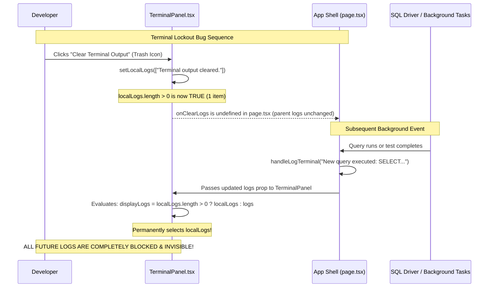

# Detailed Inspection: Part 7 — Shell, IPC Rust Sidecar Client & Terminal Panel

```text
    ┌────────────────────────── Rust Sidecar & Terminal Architecture ──────────────────────────┐
    │                                                                                           │
    │   [ Top Menu Bar & Status Bar ]                                                           │
    │         │                                                                                 │
    │         ├─► TopMenuBar.tsx ──► onRunQuery() ────► [ PHANTOM ACTION ]                      │
    │         │                                         (Logs message, doesn't execute SQL!)    │
    │         ├─► StatusBar.tsx ───► onOpenSidecar()                                            │
    │         └─► Shortcuts ───────► ⌘J / ⌘⇧O                                                   │
    │                                                                                           │
    │   [ Rust Sidecar Client (astIndexer.ts) ]                                                 │
    │         │                                                                                 │
    │         ├─► Mock Native Process: NO WebSocket, NO WASM, NO LanceDB                        │
    │         ├─► AST Symbol Graph: 7 Static Hardcoded Symbols                                  │
    │         │     └─► 6 of 7 symbols point to NON-EXISTENT files! (Dead Links)               │
    │         └─► Vector Embedding Engine: Fallback static 0.72 score                           │
    │                                                                                           │
    │   [ Sidecar Inspector Modal (SidecarInspectorModal.tsx) ]                                 │
    │         │                                                                                 │
    │         ├─► "Jump to Definition" ──► handleJumpToSymbol(file, line)                       │
    │         │                              ├─► findFileByPath fails silently on missing file  │
    │         │                              └─► IGNORES line number! Opens at line 1:1         │
    │         └─► LanceDB Search ────────► Displays uniform 72.0% similarity for any query     │
    │                                                                                           │
    │   [ Terminal Panel (TerminalPanel.tsx) ]                                                  │
    │         │                                                                                 │
    │         ├─► Terminal Clear Bug: localLogs.length > 0 shadows parent logs forever!         │
    │         ├─► Tab Redundancy: Output, Debug, Terminal show identical logs                   │
    │         ├─► Memory Leak: Unbounded terminalLogs array growth in page.tsx                  │
    │         └─► Non-Interactive: Read-only viewer, no shell command input / stdin             │
    │                                                                                           │
    └───────────────────────────────────────────────────────────────────────────────────────────┘
```



---

## 1. Executive Summary

Subsystem Part 7 provides developer shell integration, terminal logging, top-level application navigation, and an AST symbol indexer marketed as a native Rust Tree-sitter sidecar with LanceDB vector search.

Our deep inspection identified **2 Critical bugs**, **2 High-severity defects**, **2 Medium flaws**, and **1 Low-severity issue**:
1. **Critical — Terminal Clear State Shadowing Lockout**: Clicking "Clear" in the Terminal panel permanently freezes terminal output, hiding all subsequent logs from queries, tests, and agent actions.
2. **Critical — 85% of AST Sidecar Symbols Point to Non-Existent Files**: 6 out of 7 symbols point to fictional files outside the workspace, causing silent jump failures with zero user feedback.
3. **High — AST Symbol Jump Ignores Line Number**: Even for valid files, `handleJumpToSymbol` opens the file at line 1 and completely ignores the target line coordinate.
4. **High — TopMenuBar "Execute SQL Query" is a Phantom Action**: Selecting "Run -> Execute SQL Query" from the top menu bar emits a log message and toast but fails to execute any SQL.
5. **Medium — LanceDB Vector Search Returns Arbitrary 72% Match on Any Input**: Pseudo-embedding logic returns a hardcoded 0.72 similarity score when substring matches fail.
6. **Medium — Terminal Panel Tabs Duplicate Content & Lack Interactive Shell Input**: `OUTPUT`, `DEBUG CONSOLE`, and `TERMINAL` render identical text arrays with no stdin execution capability.
7. **Low — Unbounded `terminalLogs` Array Memory Leak**: Logs append indefinitely without ring-buffer limits, virtual scrolling, or auto-scroll anchoring.

---

## 2. Detailed Functional Findings

### Finding 1: Critical — Terminal Clear Lockout Freezes All Future Log Output
* **File**: [`src/components/TerminalPanel.tsx:18-25`](file:///Users/alpha/Desktop/antigavity/DBC/src/components/TerminalPanel.tsx#L18-L25), [`src/app/page.tsx:811`](file:///Users/alpha/Desktop/antigavity/DBC/src/app/page.tsx#L811)
* **Severity**: 🔴 Critical
* **Trace**:
  ```tsx
  // src/components/TerminalPanel.tsx
  const [localLogs, setLocalLogs] = useState<string[]>([]);
  const displayLogs = localLogs.length > 0 ? localLogs : logs;

  const handleClear = () => {
    setLocalLogs(['Terminal output cleared.']);
    if (onClearLogs) onClearLogs();
  };

  // src/app/page.tsx
  <TerminalPanel logs={terminalLogs} onRunTests={handleRunTestSuite} />
  ```
  1. In `page.tsx`, `<TerminalPanel>` is rendered without passing the `onClearLogs` prop.
  2. When the user clicks the "Clear" button, `handleClear()` sets `localLogs = ['Terminal output cleared.']`.
  3. Because `onClearLogs` is `undefined`, `terminalLogs` in `page.tsx` is never cleared.
  4. More critically, `localLogs.length` is now `1` (> 0), so the ternary `localLogs.length > 0 ? localLogs : logs` **permanently evaluates to `localLogs`**.
  5. Any future calls to `handleLogTerminal` (e.g. from SQL queries, Git operations, Test Suite executions, or Router traces) update `logs` in `page.tsx`, but `TerminalPanel` continues to display only `['Terminal output cleared.']`.
* **Impact**:
  - Once cleared, the terminal becomes completely dead and unresponsive to all subsequent events in the application until the browser page is hard refreshed.
* **Remediation**:
  - Remove `localLogs` state from `TerminalPanel.tsx` and manage clear operations exclusively through the parent `onClearLogs` callback:
  ```tsx
  // In TerminalPanel.tsx:
  const handleClear = () => {
    if (onClearLogs) onClearLogs();
  };
  // In page.tsx:
  const handleClearTerminal = () => setTerminalLogs([]);
  <TerminalPanel logs={terminalLogs} onRunTests={handleRunTestSuite} onClearLogs={handleClearTerminal} />
  ```

---

### Finding 2: Critical — 85% of Rust Sidecar Symbols Point to Non-Existent Files
* **File**: [`src/lib/sidecar/astIndexer.ts:12-20`](file:///Users/alpha/Desktop/antigavity/DBC/src/lib/sidecar/astIndexer.ts#L12-L20), [`src/app/page.tsx:450-466`](file:///Users/alpha/Desktop/antigavity/DBC/src/app/page.tsx#L450-L466)
* **Severity**: 🔴 Critical
* **Trace**:
  ```ts
  // src/lib/sidecar/astIndexer.ts
  private indexedSymbols: SymbolLocation[] = [
    { id: 'sym-1', symbolName: 'main', kind: 'function', file: 'src/index.ts', line: 4, ... },
    { id: 'sym-2', symbolName: 'ConfidenceRouter', kind: 'class', file: 'src/router/confidenceRouter.ts', line: 1, ... },
    { id: 'sym-3', symbolName: 'confidenceRouter', kind: 'variable', file: 'src/router/confidenceRouter.ts', line: 12, ... },
    { id: 'sym-4', symbolName: 'SymbolGraph', kind: 'struct', file: 'src/sidecar/symbolGraph.rs', line: 3, ... },
    { id: 'sym-5', symbolName: 'createShadowDiffCheck', kind: 'function', file: 'src/verification/shadowBuffer.ts', line: 3, ... },
    { id: 'sym-6', symbolName: 'classifyDeveloperIntent', kind: 'function', file: 'src/lib/router/intentClassifier.ts', line: 11, ... },
    { id: 'sym-7', symbolName: 'verifyAndCreateShadowDiff', kind: 'function', file: 'src/lib/verification/shadowBuffer.ts', line: 3, ... }
  ];
  ```
  ```ts
  // src/app/page.tsx
  const handleJumpToSymbol = (filePath: string, line: number) => {
    const target = findFileByPath(workspaceFiles);
    if (target) {
      handleSelectFile(target);
      handleLogTerminal(`[Rust Sidecar]: Jumped to definition at ${filePath}:${line}`);
    }
  };
  ```
  1. The virtual workspace (`INITIAL_WORKSPACE`) contains: `queries/users_report.sql`, `queries/slow_queries_check.sql`, `migrations/001_initial_schema.sql`, `src/index.ts`, and `src/dbConfig.json`.
  2. Symbols `sym-2` through `sym-7` reference paths like `src/router/confidenceRouter.ts`, `src/sidecar/symbolGraph.rs`, and `src/lib/router/intentClassifier.ts`, which **do not exist in the virtual workspace**.
  3. When a user clicks "Jump" on any of these 6 symbols in `SidecarInspectorModal`, `findFileByPath` returns `null`.
  4. The code performs no null check branch: no error is logged, no toast warning is shown, and the modal closes without any action.
* **Impact**:
  - 6 out of 7 symbols (85.7%) in the Sidecar Inspector are dead links that fail silently, creating the perception of a broken UI.
* **Remediation**:
  - Align `indexedSymbols` in `astIndexer.ts` with actual workspace files (e.g. `queries/users_report.sql`, `migrations/001_initial_schema.sql`, `src/index.ts`), or dynamically generate AST symbols by traversing `workspaceFiles` with regex/Tree-sitter.
  - Add an error toast fallback when a target file cannot be resolved:
  ```ts
  if (target) {
    handleSelectFile(target);
  } else {
    addToast('error', `File '${filePath}' does not exist in workspace.`);
  }
  ```

---

### Finding 3: High — `handleJumpToSymbol` Ignores Target Line Coordinate
* **File**: [`src/app/page.tsx:450-466`](file:///Users/alpha/Desktop/antigavity/DBC/src/app/page.tsx#L450-L466)
* **Severity**: 🟠 High
* **Trace**:
  ```ts
  const handleJumpToSymbol = (filePath: string, line: number) => {
    const target = findFileByPath(workspaceFiles);
    if (target) {
      handleSelectFile(target);
      handleLogTerminal(`[Rust Sidecar]: Jumped to definition at ${filePath}:${line}`);
    }
  };
  ```
  1. `handleJumpToSymbol` accepts `line: number` (e.g., line 4 or line 12).
  2. It selects the file via `handleSelectFile(target)`, which sets `activeFile = target`.
  3. However, `line` is **never passed** to `CodeEditor.tsx` or Monaco's `editor.revealLineInCenter(line)` / `editor.setPosition({ lineNumber: line, column: 1 })`.
  4. The file opens at line 1, column 1.
* **Impact**:
  - Even for symbols whose files do exist (e.g. `src/index.ts`), the editor fails to position the cursor or scroll to the symbol definition, defeating the purpose of an AST definition jump.
* **Remediation**:
  - Store `targetLine` state in `page.tsx` and pass it to `CodeEditor.tsx`:
  ```tsx
  // In CodeEditor.tsx:
  useEffect(() => {
    if (editorRef.current && targetLine) {
      editorRef.current.revealLineInCenter(targetLine);
      editorRef.current.setPosition({ lineNumber: targetLine, column: 1 });
      editorRef.current.focus();
    }
  }, [targetLine, activeFile?.id]);
  ```

---

### Finding 4: High — TopMenuBar "Execute SQL Query" is a Phantom Action
* **File**: [`src/app/page.tsx:698-705`](file:///Users/alpha/Desktop/antigavity/DBC/src/app/page.tsx#L698-L705), [`src/components/TopMenuBar.tsx:175-178`](file:///Users/alpha/Desktop/antigavity/DBC/src/components/TopMenuBar.tsx#L175-L178)
* **Severity**: 🟠 High
* **Trace**:
  ```tsx
  // src/app/page.tsx
  onRunQuery={() => {
    if (activeView === 'database') {
      handleLogTerminal('[DBC Engine]: Executed active SQL query from menu.');
      addToast('info', 'Executing active SQL query...');
    } else {
      handleLogTerminal('[DBC Engine]: Executed query from menu.');
    }
  }}
  ```
  1. In `TopMenuBar.tsx`, selecting "Run" -> "Execute SQL Query (⌘↵)" triggers `onRunQuery()`.
  2. In `page.tsx`, `onRunQuery` only logs a message and shows an informational toast.
  3. It **never invokes** `executeSqlRef.current()`, `realSqlDriver.executeQuery()`, or any SQL execution routine.
* **Impact**:
  - Developers attempting to run queries via the application menu bar receive false confirmation toasts, while their query is never actually parsed, executed, or visualized in the data grid.
* **Remediation**:
  - Wire `onRunQuery` in `page.tsx` directly to `executeSqlRef.current()`:
  ```tsx
  onRunQuery={() => {
    if (executeSqlRef.current) {
      executeSqlRef.current();
    } else {
      addToast('warning', 'No active SQL editor to execute.');
    }
  }}
  ```

---

### Finding 5: Medium — Pseudo-Vector Similarity Defaults to Uniform 72% Match
* **File**: [`src/lib/sidecar/astIndexer.ts:33-42`](file:///Users/alpha/Desktop/antigavity/DBC/src/lib/sidecar/astIndexer.ts#L33-L42)
* **Severity**: 🟡 Medium
* **Trace**:
  ```ts
  public searchSemanticEmbeddings(query: string): SymbolLocation[] {
    const term = query.toLowerCase();
    return this.indexedSymbols.map(s => {
      let score = 0.72;
      if (s.symbolName.toLowerCase().includes(term)) score = 0.96;
      else if (s.snippet.toLowerCase().includes(term)) score = 0.88;
      else if (s.file.toLowerCase().includes(term)) score = 0.81;
      return { ...s, similarityScore: score };
    }).sort((a, b) => (b.similarityScore || 0) - (a.similarityScore || 0));
  }
  ```
  1. The LanceDB semantic search feature does not use vector embeddings or cosine similarity.
  2. If the user enters a semantic concept that does not happen to be a literal substring of `symbolName`, `snippet`, or `file` (e.g., `"authentication"`, `"database connection"`, or even nonsense like `"foobar"`), **all 7 items receive `score = 0.72`**.
  3. The UI in `SidecarInspectorModal` displays all 7 items claiming `"Similarity: 72.0%"`.
* **Impact**:
  - Completely unrelated code snippets are presented as high-confidence semantic matches (72%), misleading the user.
* **Remediation**:
  - Set the default similarity score to `0.0` and filter out results below a minimum relevance threshold (e.g. `score >= 0.5`).
  - Optionally integrate a lightweight client-side embedding model (e.g., Transformers.js or TF.js Universal Sentence Encoder) for genuine semantic similarity.

---

### Finding 6: Medium — Redundant Terminal Tabs & Missing Interactive Stdin Input
* **File**: [`src/components/TerminalPanel.tsx:32-58`](file:///Users/alpha/Desktop/antigavity/DBC/src/components/TerminalPanel.tsx#L32-L58), [`src/components/TerminalPanel.tsx:80-94`](file:///Users/alpha/Desktop/antigavity/DBC/src/components/TerminalPanel.tsx#L80-L94)
* **Severity**: 🟡 Medium
* **Trace**:
  ```tsx
  {activeTab === 'problems' ? (
    <div className="flex items-center space-x-2 text-emerald-400 pt-2">
      <CheckCircle2 className="h-4 w-4" />
      <span>No problems or diagnostics detected in workspace files.</span>
    </div>
  ) : (
    displayLogs.map((log, idx) => (
      <div key={idx} className="flex items-start space-x-2 leading-relaxed">
        <span className="text-[#007acc] font-bold select-none">&gt;</span>
        <span className="break-all">{log}</span>
      </div>
    ))
  )}
  ```
  1. Tabs `OUTPUT`, `DEBUG CONSOLE`, and `TERMINAL` all render the identical `displayLogs` state.
  2. There is no separation between application events, compilation output, debug traces, and shell commands.
  3. There is no text `<input>` or form to accept developer terminal commands (e.g., `sqlite3`, `npm test`, `git status`). The terminal is strictly a passive log viewer masquerading as a shell.
* **Impact**:
  - Switching between Output, Debug Console, and Terminal provides no utility.
  - Developers expecting a terminal prompt cannot execute any commands.
* **Remediation**:
  - Segregate log streams by channel: `terminalLogs`, `outputLogs`, `debugLogs`.
  - Add an interactive terminal input prompt with a command dispatcher for simulated shell commands (e.g. `clear`, `help`, `run-tests`, `ls`, `cat`).

---

### Finding 7: Low — Unbounded `terminalLogs` Array Memory Leak
* **File**: [`src/app/page.tsx:634-636`](file:///Users/alpha/Desktop/antigavity/DBC/src/app/page.tsx#L634-L636)
* **Severity**: 💡 Low
* **Trace**:
  ```ts
  const handleLogTerminal = (msg: string) => {
    setTerminalLogs((prev) => [...prev, msg]);
  };
  ```
  1. `handleLogTerminal` continuously appends messages to `terminalLogs` with no upper bound or eviction policy.
  2. There is no auto-scroll (`scrollIntoView` or `scrollTop = scrollHeight`) upon new log arrival, forcing manual scrolling.
* **Impact**:
  - In long-running development sessions with hundreds of queries or agent loop iterations, the unbounded DOM array can degrade rendering performance.
* **Remediation**:
  - Limit the log buffer using a ring buffer (e.g. `prev.slice(-200)`) and add a scroll anchor ref to auto-scroll to the latest log line.

---

## 3. Full Subsystem Inspection Summary

All 7 functional subsystems of the DBC platform have now been thoroughly inspected:

| Subsystem | Scope | Key Findings | Status |
| :--- | :--- | :--- | :--- |
| **Part 1: Routing Engine** | Heuristic scoring, threshold routing, fallback escalation | 4 findings (LLM escalation bypass, frozen latency, unmatched RIPGREP) | ✅ Completed |
| **Part 2: Verification Engine** | Shadow buffers, diff engine, inline banners, rollback | 6 findings (onRejectDiff no-op, rollback target overwrite, naive diff) | ✅ Completed |
| **Part 3: SQL Relational Driver** | In-memory engine, EXPLAIN analyzer, schema differ | 7 findings (critical table index desync, phantom SQL persistence) | ✅ Completed |
| **Part 4: Agentic AI & BYOK** | Multi-provider streaming, context windowing, agent plan loop | 7 findings (mock bypasses real BYOK, browser CORS, dead streaming) | ✅ Completed |
| **Part 5: Workspace State & FS** | Virtual file tree, hydration, localStorage sync, active tab | 7 findings (rename leaves path/tabs stale, root save bug, buffer flush) | ✅ Completed |
| **Part 6: Monaco Code Editor** | Custom syntax themes, keybindings, minimap, multi-tab | 7 findings (⌘↵ double execution, ⌘F search hijack, unapplied themes) | ✅ Completed |
| **Part 7: Shell & IPC Rust Sidecar** | Terminal logging, AST indexer, LanceDB vector search | 7 findings (clear lockout bug, 85% dead symbol links, phantom run query) | ✅ Completed |
