```mermaid
graph TD
    subgraph Phase1["Phase 1: Critical Showstoppers"]
        P6_1["Fix ⌘↵ Event Bubbling (Double Execution)"]
        P6_2["Unbind Global ⌘F from Monaco"]
        P7_1["Fix Terminal Clear Lockout"]
        P7_2["Align Sidecar AST Paths with Workspace"]
        P3_1["Fix Table Editor Row Index Desync"]
        P3_2["Persist Inline Query Panel Cell Edits"]
        P2_1["Revert Editor Buffer on Diff Rejection"]
        P2_2["Fix Rollback File Target Overwrite"]
        P5_1["Sync File Paths on Rename"]
        P5_2["Fix 'Save SQL Script' Folder Path"]
    end

    subgraph Phase2["Phase 2: Functional Integrity"]
        P1_1["Connect Router to Real BYOK Client"]
        P4_2["Make Router Engine Fully Asynchronous"]
        P4_3["Add CORS Proxy for Direct Anthropic Calls"]
        P4_4["Consume SSE Stream Generator in UI"]
        P3_3["Handle Trailing Semicolons in SQL Engine"]
        P3_4["Detect Dropped Columns in Schema Differ"]
        P6_3["Implement Global CSS Shell Theming"]
        P7_3["Wire Monaco revealLine for AST Jump"]
        P7_4["Wire TopMenuBar 'Run Query' to SQL Driver"]
        P5_3["Auto-Sync In-Memory Buffer to LocalStorage"]
        P5_4["Purge Zombie Tabs on Folder Deletion"]
    end

    subgraph Phase3["Phase 3: Robustness & Ergonomics"]
        P1_3["Handle 'RIPGREP_SEARCH' Strategy"]
        P1_4["Support Backtick Identifiers in SQL Regex"]
        P2_4["Enforce Exact Bracket AST Balance"]
        P3_5["Fix DDL Comma Splitting for Types"]
        P3_7["Namespace JOIN Columns on Collision"]
        P5_6["Escape Regex in Global Replace-All"]
        P7_6["Segregate Terminal Streams & Add Stdin"]
        P7_7["Cap Terminal Logs to 500 Lines"]
        P6_7["Dynamic Ctrl vs ⌘ Platform Glyphs"]
    end

    Phase1 --> Phase2
    Phase2 --> Phase3
```

# DBC Platform — Master Remediation Plan & Engineering Roadmap

```text
    ┌────────────────────────────────────────────────────────────────────────────────────────┐
    │                               DBC Remediation Lifecycle                                │
    ├────────────────────────────────────────────────────────────────────────────────────────┤
    │                                                                                        │
    │   PHASE 1: Critical Showstoppers (11 Findings)                                         │
    │   ├─► Monaco & Keybindings : Stop ⌘↵ double execution & ⌘F find hijack                 │
    │   ├─► Terminal & Sidecar   : Eliminate clear-lockout bug & sync AST file paths         │
    │   ├─► Database Engine      : Fix table grid row index desync & cell persistence        │
    │   ├─► Workspace State      : Fix rename path desync & queries/ folder routing          │
    │   └─► Verification Engine  : Restore onRejectDiff revert & target snapshot rollback    │
    │                                       │                                                │
    │                                       ▼                                                │
    │   PHASE 2: Functional Integrity & Logic Repairs (14 Findings)                          │
    │   ├─► Router & AI Agents   : Connect real BYOK client & convert router to async        │
    │   ├─► Network & Streaming  : Fix Anthropic CORS proxy & consume streaming chunks       │
    │   ├─► SQL Parser & DDL     : Handle trailing semicolons & omitted dropped columns      │
    │   └─► UI Shell & AST       : Unify application theming & wire Jump-to-Line in Monaco   │
    │                                       │                                                │
    │                                       ▼                                                │
    │   PHASE 3: Robustness, Ergonomics & Quality of Life (20 Findings)                      │
    │   ├─► Parsing Edge Cases   : SQL backticks, decimal DDL types, JOIN column collision   │
    │   ├─► Reliability & Bounds : Bound terminal log memory, escape regex replace-all       │
    │   └─► UX Polish & Parity   : Dynamic table palette actions, Windows/Linux key glyphs   │
    │                                                                                        │
    └────────────────────────────────────────────────────────────────────────────────────────┘
```



---

## 1. Remediation Strategy & Guiding Principles

This master remediation plan addresses all **45 vulnerabilities, logic gaps, race conditions, and stub mocks** uncovered during the comprehensive 7-part functional inspection of the DBC platform.

### Principles:
1. **Safety First**: Zero data loss, zero silent file overwrites, and no unhandled exceptions in critical user flows.
2. **Deterministic Precedence**: Never break existing working fast-paths while upgrading agentic fallback mechanisms.
3. **No Unnecessary Builds**: Adhere strictly to the workspace mandate: `DON'T RUN BUILD EVERY TIME`. Validate all intermediate edits via `npx tsc --noEmit`.
4. **Step-by-Step Verification**: Every fix must be verified against its documented reproduction scenario before committing.

---

## 2. Phase 1: Critical Showstoppers (Immediate Priority)

Phase 1 focuses on bugs that cause **data corruption, infinite UI lockouts, race conditions, or complete operation failure**.

### Summary Matrix: Phase 1
| ID | Subsystem | File & Lines | Defect Summary | Severity |
|---|---|---|---|:---:|
| **P6-F1** | Monaco Editor | [`SqlQueryPanel.tsx:107-111`](file:///Users/alpha/Desktop/antigavity/DBC/src/components/SqlQueryPanel.tsx#L107-L111), [`page.tsx:287-293`](file:///Users/alpha/Desktop/antigavity/DBC/src/app/page.tsx#L287-L293) | Double query execution on `⌘↵` | 🔴 Critical |
| **P6-F2** | Monaco Editor | [`page.tsx:275-279`](file:///Users/alpha/Desktop/antigavity/DBC/src/app/page.tsx#L275-L279) | Global `⌘F` listener hijacks Monaco in-file search | 🔴 Critical |
| **P7-F1** | Terminal Panel | [`TerminalPanel.tsx:18-25`](file:///Users/alpha/Desktop/antigavity/DBC/src/components/TerminalPanel.tsx#L18-L25), [`page.tsx:811`](file:///Users/alpha/Desktop/antigavity/DBC/src/app/page.tsx#L811) | Clear button permanently freezes terminal output | 🔴 Critical |
| **P7-F2** | Rust Sidecar | [`astIndexer.ts:12-20`](file:///Users/alpha/Desktop/antigavity/DBC/src/lib/sidecar/astIndexer.ts#L12-L20), [`page.tsx:450-466`](file:///Users/alpha/Desktop/antigavity/DBC/src/app/page.tsx#L450-L466) | 85% of AST symbols point to fictional files (dead links) | 🔴 Critical |
| **P3-F1** | SQL Driver | [`TableDataEditor.tsx:75-90`](file:///Users/alpha/Desktop/antigavity/DBC/src/components/TableDataEditor.tsx#L75-L90) | Table editor edits wrong row when sorted or filtered | 🔴 Critical |
| **P3-F2** | SQL Driver | [`SqlQueryPanel.tsx:180-210`](file:///Users/alpha/Desktop/antigavity/DBC/src/components/SqlQueryPanel.tsx#L180-L210) | Inline query cell edits never persist to database driver | 🔴 Critical |
| **P2-F1** | Verification | [`page.tsx:645-654`](file:///Users/alpha/Desktop/antigavity/DBC/src/app/page.tsx#L645-L654) | Rejecting a diff fails to revert active editor buffer | 🔴 Critical |
| **P2-F2** | Verification | [`page.tsx:660-672`](file:///Users/alpha/Desktop/antigavity/DBC/src/app/page.tsx#L660-L672) | Snapshot rollback overwrites active file instead of target file | 🔴 Critical |
| **P5-F1** | File Tree | [`page.tsx:395-410`](file:///Users/alpha/Desktop/antigavity/DBC/src/app/page.tsx#L395-L410) | Renaming file updates `name` but leaves `path` and tabs stale | 🔴 Critical |
| **P5-F2** | File Tree | [`page.tsx:580-595`](file:///Users/alpha/Desktop/antigavity/DBC/src/app/page.tsx#L580-L595) | Save SQL Script saves to root instead of `queries/` folder | 🔴 Critical |
| **P4-F1** | Agentic AI | [`llmEngine.ts:16-17`](file:///Users/alpha/Desktop/antigavity/DBC/src/lib/router/llmEngine.ts#L16-L17) | LLM reasoning calls dummy mock instead of real BYOK client | 🔴 Critical |

---

### Phase 1 Remediation Specifications

#### 1. Fix Monaco `⌘↵` Double Execution (`P6-F1`)
* **Cause**: `SqlQueryPanel` binds `monaco.KeyMod.CtrlCmd | monaco.KeyCode.Enter` to run the query, but does not consume or stop event propagation. Meanwhile, `page.tsx` has a `window.addEventListener('keydown')` that also catches `⌘↵` when `activeView === 'database'`.
* **Fix**:
  - In `SqlQueryPanel.tsx`, call `e?.stopPropagation()` or check if Monaco already handled the execution.
  - In `page.tsx`, remove the duplicate `⌘↵` listener in the global `window` dispatcher when Monaco has focus, or establish a single centralized execution coordinator ref.

#### 2. Restore Monaco In-File Find on `⌘F` (`P6-F2`)
* **Cause**: `window.addEventListener('keydown')` in `page.tsx` unconditionally triggers `setIsSearchOpen(true)` whenever `(e.metaKey || e.ctrlKey) && e.key === 'f'`.
* **Fix**:
  - Check whether the event target is inside Monaco (`e.target.closest('.monaco-editor')`).
  - If focused in Monaco, return early and allow Monaco's native in-editor find widget to open.
  - Bind global workspace search to `⌘⇧F` (Cmd+Shift+F), matching standard VS Code behavior.

#### 3. Eliminate Terminal Clear Lockout Bug (`P7-F1`)
* **Cause**: `TerminalPanel.tsx` sets `localLogs = ['Terminal output cleared.']`. Because `localLogs.length > 0`, `displayLogs` permanently displays `localLogs`, ignoring all new incoming logs in `logs`.
* **Fix**:
  - Pass `onClearLogs={() => setTerminalLogs([])}` from `page.tsx` to `<TerminalPanel>`.
  - Remove `localLogs` state from `TerminalPanel.tsx` completely; rely on the parent `logs` prop as the single source of truth.

#### 4. Align Rust Sidecar AST Symbols with Real Workspace Files (`P7-F2`)
* **Cause**: `astIndexer.ts` contains 7 static symbols pointing to paths like `src/router/confidenceRouter.ts` and `src/sidecar/symbolGraph.rs` that do not exist in `INITIAL_WORKSPACE`.
* **Fix**:
  - Update `indexedSymbols` in `astIndexer.ts` to reference actual files in `INITIAL_WORKSPACE` (`src/index.ts`, `queries/users_report.sql`, `migrations/001_initial_schema.sql`).
  - Add an error toast fallback in `handleJumpToSymbol` if a file cannot be resolved.

#### 5. Fix Table Data Editor Row Index Desync (`P3-F1`)
* **Cause**: `TableDataEditor.tsx` maps over `filteredData`, but modifies `targetTable.data[rowIndex]` where `rowIndex` is the index in `filteredData`, corrupting wrong rows when sorted or filtered.
* **Fix**:
  - Identify rows by primary key (e.g. `row.id`) rather than numerical array offset:
    ```ts
    const originalIndex = targetTable.data.findIndex((r) => r.id === rowId);
    if (originalIndex !== -1) {
      targetTable.data[originalIndex][col] = value;
    }
    ```

#### 6. Persist Inline Query Cell Edits to Real Database Driver (`P3-F2`)
* **Cause**: `SqlQueryPanel.tsx` allows cell editing on query result grids, but only modifies local React state without issuing `UPDATE` statements to `realSqlDriver`.
* **Fix**:
  - When a query result cell is committed, generate and execute an `UPDATE [table] SET [col] = ? WHERE id = ?` on `realSqlDriver`, and reload the table view.

#### 7. Revert Editor Buffer on Shadow Diff Rejection (`P2-F1`)
* **Cause**: `onRejectDiff` marks the diff status as `REJECTED`, but leaves the active editor buffer modified with the speculative patch.
* **Fix**:
  - Store the pre-patch content (`diffCheck.originalContent`) and restore it into `activeFile.content` upon rejection:
    ```ts
    handleContentChange(diffCheck.originalContent);
    ```

#### 8. Fix Snapshot Rollback Target File Overwrite (`P2-F2`)
* **Cause**: `handleRollbackSnapshot` overwrites `activeFile` with `diffCheck.originalContent`, even if the snapshot was taken for a different file in the workspace.
* **Fix**:
  - Look up the file matching `diffCheck.filePath` from `workspaceFiles` and restore content directly to that specific file node, rather than assuming `activeFile`.

#### 9. Fix File Tree Rename Stale Path Desync (`P5-F1`)
* **Cause**: `handleRenameFile` updates `n.name = newName`, but does not recalculate `n.path` or update open tabs in `openFiles`.
* **Fix**:
  - Compute `newPath = parentPath ? `${parentPath}/${newName}` : newName`.
  - Update `n.path = newPath`.
  - Update all open tabs in `openFiles` whose path or id matches the renamed file.

#### 10. Fix "Save SQL Script" Destination Folder (`P5-F2`)
* **Cause**: `handleSaveScript` creates a new file at root `path: scriptName`, while logging that it was saved to `queries/${scriptName}`.
* **Fix**:
  - Find the `queries` folder node and insert the new file as a child of `queries`, setting `path: queries/${scriptName}`.

---

## 3. Phase 2: Functional Integrity & Logic Repairs (High Priority)

Phase 2 connects disconnected subsystems, converts synchronous blocking calls to asynchronous pipelines, handles syntax edge cases, and aligns UI presentation with the theme system.

### Summary Matrix: Phase 2
| ID | Subsystem | File & Lines | Defect Summary | Severity |
|---|---|---|---|:---:|
| **P1-F1** | Router | [`llmEngine.ts:16-17`](file:///Users/alpha/Desktop/antigavity/DBC/src/lib/router/llmEngine.ts#L16-L17) | LLM escalation bypasses real BYOK client | 🟠 High |
| **P1-F2** | Router | [`routerEngine.ts:45-56`](file:///Users/alpha/Desktop/antigavity/DBC/src/lib/router/routerEngine.ts#L45-L56) | Rolling latency metric frozen at initial static constant | 🟠 High |
| **P2-F3** | Verification | [`shadowBuffer.ts:35-52`](file:///Users/alpha/Desktop/antigavity/DBC/src/lib/verification/shadowBuffer.ts#L35-L52) | Naive line differ causes cascading false diffs on insertions | 🟠 High |
| **P3-F3** | SQL Driver | [`sqlDriver.ts:130-175`](file:///Users/alpha/Desktop/antigavity/DBC/src/lib/db/sqlDriver.ts#L130-L175) | Trailing semicolons and newlines break regex mutation parsers | 🟠 High |
| **P3-F4** | SQL Driver | [`schemaDiffer.ts:45-70`](file:///Users/alpha/Desktop/antigavity/DBC/src/lib/db/schemaDiffer.ts#L45-L70) | Schema differ ignores dropped/deleted columns | 🟠 High |
| **P4-F2** | Agentic AI | [`routerEngine.ts:60-80`](file:///Users/alpha/Desktop/antigavity/DBC/src/lib/router/routerEngine.ts#L60-L80) | Synchronous router blocks asynchronous BYOK streaming | 🟠 High |
| **P4-F3** | Agentic AI | [`byokClient.ts:120-145`](file:///Users/alpha/Desktop/antigavity/DBC/src/lib/agent/byokClient.ts#L120-L145) | Anthropic API direct browser calls blocked by CORS | 🟠 High |
| **P4-F4** | Agentic AI | [`byokClient.ts:150-180`](file:///Users/alpha/Desktop/antigavity/DBC/src/lib/agent/byokClient.ts#L150-L180) | `streamNvidia` generator created but never consumed by UI | 🟠 High |
| **P5-F3** | Workspace | [`page.tsx:145-160`](file:///Users/alpha/Desktop/antigavity/DBC/src/app/page.tsx#L145-L160) | In-memory edits lost on refresh unless explicitly saved | 🟠 High |
| **P5-F4** | Workspace | [`page.tsx:420-435`](file:///Users/alpha/Desktop/antigavity/DBC/src/app/page.tsx#L420-L435) | Deleting folder leaves open orphan tabs | 🟠 High |
| **P6-F3** | Monaco / UI | [`monacoThemes.ts`](file:///Users/alpha/Desktop/antigavity/DBC/src/lib/monacoThemes.ts), [`globals.css`](file:///Users/alpha/Desktop/antigavity/DBC/src/app/globals.css) | Themes isolated to Monaco; IDE shell remains hardcoded dark | 🟠 High |
| **P6-F4** | Monaco / UI | [`page.tsx:300-305`](file:///Users/alpha/Desktop/antigavity/DBC/src/app/page.tsx#L300-L305) | Browser shortcut collision on `⌘W` and `⌘N` | 🟠 High |
| **P7-F3** | Sidecar | [`page.tsx:450-466`](file:///Users/alpha/Desktop/antigavity/DBC/src/app/page.tsx#L450-L466) | AST symbol jump opens file at line 1, ignoring line coordinate | 🟠 High |
| **P7-F4** | Shell | [`page.tsx:698-705`](file:///Users/alpha/Desktop/antigavity/DBC/src/app/page.tsx#L698-L705), [`TopMenuBar.tsx:175-178`](file:///Users/alpha/Desktop/antigavity/DBC/src/components/TopMenuBar.tsx#L175-L178) | TopMenuBar "Execute SQL Query" is a phantom action | 🟠 High |

---

### Phase 2 Remediation Specifications

#### 1. Wire Router Escalation to Real BYOK Client (`P1-F1` & `P4-F2`)
* **Action**:
  - Update `routeRequest()` in `routerEngine.ts` to be `async`.
  - In `llmEngine.ts`, replace the mock `runLLMReasoning` call with `byokClient.executeChatCompletion()` using the user's active API keys and selected model.
  - Update caller in `page.tsx` (`handleExecutePrompt`) to await the async routing result.

#### 2. Fix Trailing Semicolons in SQL Mutation Parsers (`P3-F3`)
* **Action**:
  - Sanitize input queries in `sqlDriver.ts` before running regexes by trimming trailing whitespace and semicolons:
    ```ts
    const sanitizedQuery = query.trim().replace(/;+$/, '');
    ```

#### 3. Detect Dropped Columns in Schema Differ (`P3-F4`)
* **Action**:
  - In `schemaDiffer.ts`, perform a two-way comparison:
    1. Loop source columns to detect additions and modifications.
    2. Loop target columns to detect columns that exist in target but are missing in source, generating `ALTER TABLE ... DROP COLUMN`.

#### 4. Support Anthropic CORS Proxy & Consume SSE Streaming (`P4-F3` & `P4-F4`)
* **Action**:
  - Add client-side CORS detection: if running Anthropic in browser without a server backend, route through Next.js API route proxy (`/api/ai/anthropic`) or alert the user.
  - Implement an async chunk reader in `page.tsx` for `streamNvidia` so agent reasoning tokens stream progressively into the Mission Control UI.

#### 5. Reveal Target Line on AST Symbol Jump (`P7-F3`)
* **Action**:
  - Add `targetLine: number | null` state in `page.tsx`.
  - In `CodeEditor.tsx`, add an effect that calls `editor.revealLineInCenter(targetLine)` and `editor.setPosition({ lineNumber: targetLine, column: 1 })` when `targetLine` updates.

#### 6. Connect TopMenuBar "Execute SQL Query" to Driver (`P7-F4`)
* **Action**:
  - In `page.tsx`, update `onRunQuery` prop of `TopMenuBar` to invoke `executeSqlRef.current()`.

#### 7. Unify Application Shell CSS Theming (`P6-F3`)
* **Action**:
  - Map `data-theme` values (`monokai`, `onedark`, `cyberpunk`, `vscode-dark`) to CSS custom variables in `globals.css` (`--bg-primary`, `--bg-sidebar`, `--border-color`, `--text-primary`).
  - Replace hardcoded hex colors (`#1e1e1e`, `#252526`, `#3c3c3c`) with CSS variables across `page.tsx`, `ActivityBar.tsx`, `FileExplorer.tsx`, and `TopMenuBar.tsx`.

---

## 4. Phase 3: Robustness, Ergonomics & Quality of Life (Polish)

Phase 3 addresses **edge cases, boundary limits, memory leaks, and cross-platform UX polish**.

### Summary Matrix: Phase 3
| ID | Subsystem | File & Lines | Defect Summary | Severity |
|---|---|---|---|:---:|
| **P1-F3** | Router | [`intentClassifier.ts:40-42`](file:///Users/alpha/Desktop/antigavity/DBC/src/lib/router/intentClassifier.ts#L40-L42) | Classifier maps to unhandled strategy `'RIPGREP_SEARCH'` | 🟡 Medium |
| **P1-F4** | Router | [`intentClassifier.ts:28-30`](file:///Users/alpha/Desktop/antigavity/DBC/src/lib/router/intentClassifier.ts#L28-L30) | Regex omits backtick-quoted table identifiers | 💡 Low |
| **P2-F4** | Verification | [`shadowBuffer.ts:65-78`](file:///Users/alpha/Desktop/antigavity/DBC/src/lib/verification/shadowBuffer.ts#L65-L78) | AST check tolerates bracket count delta `< 2` | 🟡 Medium |
| **P2-F5** | Verification | [`page.tsx:510-530`](file:///Users/alpha/Desktop/antigavity/DBC/src/app/page.tsx#L510-L530) | Fast path directly applies edits without shadow verification | 🟡 Medium |
| **P2-F6** | Verification | [`ShadowVerificationDrawer.tsx:25-30`](file:///Users/alpha/Desktop/antigavity/DBC/src/components/ShadowVerificationDrawer.tsx#L25-L30) | Unused state variables in drawer component | 💡 Low |
| **P3-F5** | SQL Driver | [`sqlDriver.ts:80-105`](file:///Users/alpha/Desktop/antigavity/DBC/src/lib/db/sqlDriver.ts#L80-L105) | Naive comma split breaks DDL parameterized types | 🟡 Medium |
| **P3-F6** | SQL Driver | [`page.tsx:740-750`](file:///Users/alpha/Desktop/antigavity/DBC/src/app/page.tsx#L740-L750) | "Select Top 100 Rows" context action is phantom log | 🟡 Medium |
| **P3-F7** | SQL Driver | [`sqlDriver.ts:210-235`](file:///Users/alpha/Desktop/antigavity/DBC/src/lib/db/sqlDriver.ts#L210-L235) | JOIN column namespace collision on identical field names | 💡 Low |
| **P4-F5** | Agentic AI | [`byokClient.ts:5-12`](file:///Users/alpha/Desktop/antigavity/DBC/src/lib/agent/byokClient.ts#L5-L12) | Missing `costTracker.ts` and `contextAssembler.ts` modules | 🟡 Medium |
| **P4-F6** | Agentic AI | [`page.tsx:110-125`](file:///Users/alpha/Desktop/antigavity/DBC/src/app/page.tsx#L110-L125) | Hardcoded fallback API key in source | 🟡 Medium |
| **P4-F7** | Agentic AI | [`fileTools.ts:1-60`](file:///Users/alpha/Desktop/antigavity/DBC/src/lib/agent/fileTools.ts#L1-L60) | Orphaned `fileTools.ts` redundant with persistence module | 💡 Low |
| **P5-F5** | File Tree | [`FileExplorer.tsx:85-110`](file:///Users/alpha/Desktop/antigavity/DBC/src/components/FileExplorer.tsx#L85-L110) | Nested folder expansion ID mismatch collapses folders | 🟡 Medium |
| **P5-F6** | File Tree | [`SearchModal.tsx:65-80`](file:///Users/alpha/Desktop/antigavity/DBC/src/components/SearchModal.tsx#L65-L80) | Unescaped regex in global "Replace All" crashes search | 🟡 Medium |
| **P5-F7** | File Tree | [`workspacePersistence.ts:30-50`](file:///Users/alpha/Desktop/antigavity/DBC/src/lib/workspacePersistence.ts#L30-L50) | Active tab and panel layout not persisted in localStorage | 💡 Low |
| **P6-F5** | Monaco Editor | [`monacoThemes.ts:25-71`](file:///Users/alpha/Desktop/antigavity/DBC/src/lib/monacoThemes.ts#L25-L71) | Incomplete token coverage (operators, delimiters, functions) | 🟡 Medium |
| **P6-F6** | Monaco Editor | [`page.tsx:415-416`](file:///Users/alpha/Desktop/antigavity/DBC/src/app/page.tsx#L415-L416) | Command Palette table actions hardcoded to `'users'` | 🟡 Medium |
| **P6-F7** | Monaco Editor | [`ShortcutsModal.tsx:25-56`](file:///Users/alpha/Desktop/antigavity/DBC/src/components/ShortcutsModal.tsx#L25-L56) | Hardcoded Apple `⌘` glyphs shown to Windows/Linux users | 💡 Low |
| **P7-F5** | Rust Sidecar | [`astIndexer.ts:33-42`](file:///Users/alpha/Desktop/antigavity/DBC/src/lib/sidecar/astIndexer.ts#L33-L42) | Pseudo-vector search returns uniform 72% match on any query | 🟡 Medium |
| **P7-F6** | Terminal Panel | [`TerminalPanel.tsx:32-94`](file:///Users/alpha/Desktop/antigavity/DBC/src/components/TerminalPanel.tsx#L32-L94) | Redundant terminal tabs and missing interactive stdin input | 🟡 Medium |
| **P7-F7** | Terminal Panel | [`page.tsx:634-636`](file:///Users/alpha/Desktop/antigavity/DBC/src/app/page.tsx#L634-L636) | Unbounded `terminalLogs` array causes memory leak | 💡 Low |

---

## 5. Verification & Acceptance Criteria

To ensure high software quality, every phase must satisfy rigorous automated and manual checks:

### Automated Checks
- Run `npx tsc --noEmit` after every single batch to ensure 0 TypeScript compilation errors.
- Do NOT run `npm run build` after routine edits.

### Manual Test Scenarios by Subsystem
1. **Monaco & Shortcuts**:
   - Focus SQL query panel, press `⌘↵`. Verify query runs exactly once in terminal logs and query history.
   - Focus Monaco editor, press `⌘F`. Verify Monaco in-file search widget opens; press `⌘⇧F` and verify workspace search opens.
2. **Terminal Panel**:
   - Execute a query, click the trash can "Clear" button. Execute a second query. Verify the second query log appears immediately in the terminal.
3. **Database Grid**:
   - Sort table by `username DESC`. Edit a cell in the 1st visible row. Verify the edit applies to that exact user record and not the first row of the unsorted table.
4. **Rust Sidecar**:
   - Open Sidecar Inspector Modal. Click "Jump" on any symbol. Verify active file changes and Monaco reveals and focuses the specific definition line.
5. **File Tree**:
   - Rename `users_report.sql` to `analytics.sql`. Verify the open tab name and path update instantly without error.
   - Click "Save SQL Script". Verify the script is placed inside the `queries/` folder in the tree.
