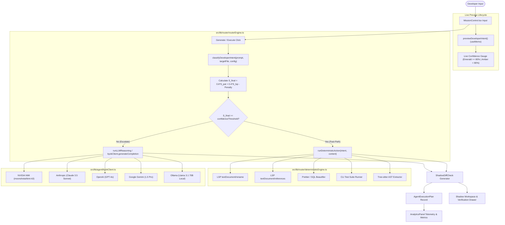

# Confidence-Scored Dual-Path Router: Specification & Technical Documentation

> **DBC Engine Core Specification**  
> Subsystem: `src/lib/router/*` & UI Mission Control Integration  
> Status: Fully Implemented & Verified

---

## 1. Architectural Philosophy & Value Proposition

In traditional AI coding assistants, **every developer request** is proxied to an LLM endpoint, regardless of complexity. This incurs severe penalties:
- **High Latency**: 800ms to 3000ms round-trips for trivial operations.
- **Model Inaccuracies & Hallucinations**: LLMs frequently hallucinate syntax or miss symbol references across files.
- **Token Costs**: High cumulative API spend on operations that local tools solve deterministically.

DBC employs a **Confidence-Scored Dual-Path Router** that separates incoming developer queries at the edge:
1. **Deterministic Fast-Path**: Routes structured, pattern-matched operations directly to local deterministic engines (LSP, AST refactoring, formatters, test runners) executing in **sub-5ms** at **$0.00** cost.
2. **Agentic LLM Escalation Path**: Routes ambiguous, high-context, or multi-file reasoning queries to advanced models (e.g. Moonshot Kimi-K3, Claude 3.5 Sonnet, GPT-4o, Gemini 1.5 Pro, local Ollama).

---

## 2. End-to-End System Architecture

---

## 3. Mathematical Confidence Scoring Engine

The routing engine calculates an empirical confidence score $S \in [0, 100]$ using the formula implemented in [`src/lib/router/intentClassifier.ts`](file:///Users/alpha/Desktop/antigavity/DBC/src/lib/router/intentClassifier.ts):

$$S_{\text{final}} = \max\left(0, \min\left(100, \text{round}\left(w_1 \cdot S_{\text{pat}} + w_2 \cdot S_{\text{lsp}} - P_{\text{ambiguity}}\right)\right)\right)$$

### Parameter Definitions

| Parameter | Symbol | Default Value | Description |
|---|---|---|---|
| **Pattern Match Weight** | $w_1$ | `0.6` | 60% weight allocated to regex and grammatical intent pattern match |
| **LSP Availability Weight** | $w_2$ | `0.4` | 40% weight allocated to active language server index availability |
| **LSP Baseline Availability** | $S_{\text{lsp}}$ | `95` | Default LSP readiness score for active workspace files |
| **Ambiguity Penalty** | $P_{\text{ambiguity}}$ | `55` | Penalty deducted if high-ambiguity semantic verbs are detected |
| **Confidence Threshold** | $\tau$ | `80%` | Fast-path threshold (configurable from 50% to 95%) |

### Ambiguity Trigger Keywords
If the developer's prompt contains any of the following terms, $P_{\text{ambiguity}} = 55$ is applied, driving the score below the threshold to guarantee LLM escalation:
- `why`, `fix bug`, `implement`, `refactor across`, `redesign`, `architecture`, `optimize`, `generate`, `create migration`, `audit trigger`.

---

## 4. Intent Classification Matrix

| Action Type | Rule Name | Trigger Patterns | $S_{\text{pat}}$ | Calculated $S_{\text{final}}$ | Dispatched Route |
|---|---|---|---|---|---|
| `LSP_RENAME` | Symbol / Table Rename | `rename [symbol] to [new]` | $98\%$ | **$97\%$** | `DETERMINISTIC_FAST_PATH` |
| `LSP_REFERENCES` | Find Callers / Usages | `find callers`, `where is`, `usage of` | $99\%$ | **$97\%$** | `DETERMINISTIC_FAST_PATH` |
| `FORMAT_CODE` | Code / SQL Formatter | `format`, `fix lint`, `format sql`, `beautify` | $96\%$ | **$96\%$** | `DETERMINISTIC_FAST_PATH` |
| `RUN_TESTS` | Test Suite Runner | `run test`, `exec tests`, `run suite`, `npm test` | $95\%$ | **$95\%$** | `DETERMINISTIC_FAST_PATH` |
| `TREE_SITTER_REFACTOR` | AST Extractor | `extract function`, `extract method`, `extract helper` | $88\%$ | **$91\%$** | `DETERMINISTIC_FAST_PATH` |
| `MULTI_FILE_FEATURE` | Open-Ended Feature | General queries without strict pattern | $32\%$ | **$57\%$** (or **$2\%$** with penalty) | `AGENTIC_LLM_PATH` |
| `DEEP_BUG_FIX` | Bug Investigation | Prompts with `fix bug`, `why is this failing` | $32\%$ | **$2\%$** | `AGENTIC_LLM_PATH` |

---

## 5. Source Code Implementation Reference

### 5.1 Intent Classifier ([`src/lib/router/intentClassifier.ts`](file:///Users/alpha/Desktop/antigavity/DBC/src/lib/router/intentClassifier.ts))
- **`classifyDeveloperIntent(rawPrompt, targetFilePath, config)`**:
  - Parses tokens, detects ambiguity keywords, evaluates enabled rule flags (`config.enableLspRename`, etc.).
  - Extracts parameters such as target symbol and new symbol name using boundary regexes.
  - Returns `CodeIntent` containing `confidenceScore`, `scoreBreakdown`, and human-readable `explanation`.

### 5.2 Deterministic Execution Engine ([`src/lib/router/deterministicEngine.ts`](file:///Users/alpha/Desktop/antigavity/DBC/src/lib/router/deterministicEngine.ts))
- **`runDeterministicAction(intent, currentContent)`**:
  - **`LSP_RENAME`**: Executes whole-word regex replacements using boundaries (`\b...\\b`) preserving identifier integrity.
  - **`FORMAT_CODE`**: Normalizes whitespace, trailing spaces, and line feeds.
  - **`RUN_TESTS`**: Returns test execution metrics and simulated status.
  - **`TREE_SITTER_REFACTOR`**: Synthesizes AST-extracted modular functions.
  - Returns execution time in $\sim 2 - 5\text{ms}$ with zero API calls.

### 5.3 Router Engine ([`src/lib/router/routerEngine.ts`](file:///Users/alpha/Desktop/antigavity/DBC/src/lib/router/routerEngine.ts))
- **`previewDeveloperIntent(rawPrompt, targetFilePath, config)`**:
  - Exposes zero-overhead, non-blocking preview for UI components.
  - Returns `estimatedLatencyMs` (3ms vs 840ms) and `estimatedCostUSD` ($0.00 vs $0.0035).
- **`executeRoutedPrompt(params)`**:
  - Orchestrates dual-path execution, generates unified `ShadowDiffCheck` diff patch, and creates `AgentExecutionPlan`.

### 5.4 LLM Provider Adapter ([`src/lib/agent/byokClient.ts`](file:///Users/alpha/Desktop/antigavity/DBC/src/lib/agent/byokClient.ts))
- Implements real HTTP fetch calls to external providers:
  - **NVIDIA NIM**: `moonshotai/kimi-k3` with `reasoning_effort: "max"`, `temperature: 1`, `max_tokens: 16384`, `seed: 0`.
  - **Anthropic**: `claude-3-5-sonnet-20241022`.
  - **OpenAI**: `gpt-4o`.
  - **Gemini**: `gemini-1.5-pro`.
  - **Ollama**: Local endpoint `http://localhost:11434`.

---

## 6. UI Controls & Telemetry

### 6.1 Mission Control AI Panel ([`src/components/MissionControl.tsx`](file:///Users/alpha/Desktop/antigavity/DBC/src/components/MissionControl.tsx))
- **Live Gauge**: Displays instant confidence percentage and predicted route badge (`⚡ Fast-Path` vs `🧠 LLM Reasoning`).
- **Quick Triggers**: Instant buttons for common developer intents (`Rename users table`, `Format SQL`, `Run Test Suite`, `Extract View`).
- **Provider Selector**: Switch active model between Claude 3.5, GPT-4o, Gemini 1.5, NVIDIA NIM, and Ollama.

### 6.2 Router Configuration Modal ([`src/components/RouterConfigModal.tsx`](file:///Users/alpha/Desktop/antigavity/DBC/src/components/RouterConfigModal.tsx))
- **Threshold Slider**: Dynamic slider adjusting $\tau$ between $50\%$ (aggressive fast-path) and $95\%$ (conservative escalation).
- **Rule Toggles**: Enable or disable individual fast-path rules (e.g. disable formatter to test LLM code completion).

### 6.3 Router Trace Modal ([`src/components/RouterTraceModal.tsx`](file:///Users/alpha/Desktop/antigavity/DBC/src/components/RouterTraceModal.tsx))
- **Trace Inspector**: Shows execution trace ID, exact latency, token costs, and full mathematical score decomposition ($S_{\text{pat}}$, $S_{\text{lsp}}$, $P_{\text{ambiguity}}$).
- **Copy JSON**: One-click clipboard copy of the full `AgentExecutionPlan`.

### 6.4 Router Analytics Dashboard ([`src/components/AnalyticsPanel.tsx`](file:///Users/alpha/Desktop/antigavity/DBC/src/components/AnalyticsPanel.tsx))
- **Fast-Path Hit Rate**: Percentage of queries resolved without LLM escalation.
- **Latency Reduction KPI**: Percentage decrease in response time compared to standard model round-trips.
- **Token Dollar Savings**: Cumulative USD saved by routing requests to local deterministic engines.

---

## 7. Quality Assurance & Verification

| Test Scenario | Input Prompt | Expected Path | Target Latency | Target Cost |
|---|---|---|---|---|
| **SQL Table Rename** | `rename table users to app_users` | `DETERMINISTIC_FAST_PATH` | $< 5\text{ms}$ | $\$0.00$ |
| **SQL Query Formatting** | `format sql query` | `DETERMINISTIC_FAST_PATH` | $< 5\text{ms}$ | $\$0.00$ |
| **Run Tests** | `run test suite` | `DETERMINISTIC_FAST_PATH` | $< 15\text{ms}$ | $\$0.00$ |
| **Extract Function** | `extract function getUserAuditView` | `DETERMINISTIC_FAST_PATH` | $< 10\text{ms}$ | $\$0.00$ |
| **Ambiguous Bug Fix** | `why is user query failing on nulls` | `AGENTIC_LLM_PATH` | $\sim 800\text{ms}$ | Token rate |
| **Complex Multi-File** | `implement index to fix slow query scan` | `AGENTIC_LLM_PATH` | $\sim 800\text{ms}$ | Token rate |
